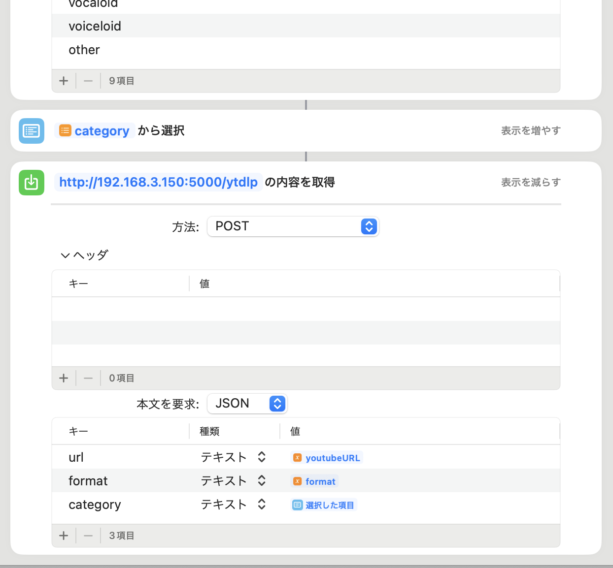

# ytdlp Server

ytdlp Sever is a API Endpoint for launch yt-dlp on your network.

## tl;dr

Ubuntuサーバを用意して、以下を実行

```sh
sudo apt update
sudo apt install docker.io cifs-utils
sudo gpasswd --add $USER docker
newgrp docker
sudo wget https://github.com/docker/compose/releases/download/v2.4.1/docker-compose-linux-x86_64 -P /usr/local/bin/docker-compose
sudo chmod +x /usr/local/bin/docker-compose
```

docker-compose.yamlの`volumes`のディレクトリをカスタマイズする。
以下はsamba共有ディレクトリを`/mnt/video`に設定する例

```sh
sudo mkdir -p /mnt/video
## if samba
sudo tee -a "//<your windows ipaddr>/<your sharing path>   /mnt/video   cifs  nofail,_netdev,x-systemd.automount,user=<your username>,password=<your password>,file_mode=0666,dir_mode=0777  0  0" /etc/fstab
sudo mount -a
```

サーバを起動する。

```sh
docker-compose up -d --scale worker=4
```

起動後、`http://<Your Server IPaddr>:5000/ytdlp`に対してPOSTリクエストを送ると、設定したディレクトリに動画がダウンロードできる。

## サーバの使い方

APIサーバに、以下のような POSTリクエストを送信する。

   ```sh
   curl -H "Content-Type: application/json" -X POST "http://localhost:5000/ytdlp" -d "{\"url\": "https://www.youtube.com/watch?v=XXXXXXXXXX", \"options\": \"--format bv*+ba/best\", \"savedir\": \"unsorted\"}
   ```

iOSショートカットなどを作成すると楽に操作できる。

<details><summary>image</summary>



</details>

## API option

| option  | type   | description                                            |
| ------- | ------ | ------------------------------------------------------ |
| url     | string | yt-dlp でダウンロードする動画URL                       |
| options | string | yt-dlp コマンドラインに利用するオプション              |
| savedir | string | 指定した場合、サブディレクトリを作成して動画を保存する |

## オプションのヒント

すべてのオプションはyt-dlpのオプションに準じる。よくある設定は以下。

- Youtubeの動画音声がローカライズされない:
  - `extractor-args` に `youtube:lang=ja` などを設定する。
  - 備考: https://github.com/yt-dlp/yt-dlp/issues/387#issuecomment-1195182084

- ファイル名が文字化けする
  - `--windows-filenames`オプションを付与する

- ログインが必要
  - `-u <ユーザ名> -p <パスワード>`オプションを付与する。

- フォーマットが意図通りにならない（webbmなど）
  - `--merge-output-format mp4`などで固定する

- 再ダウンロード（同ディレクトリへ同じファイルをダウンロード）できない
  - `--force-overwrites`を設定する

## セットアップ方法

### 前提

適当なLinuxサーバを構築し、アクセスできるようにしておく

### Dockerのインストール

ここではDockerをインストールしている

```sh
sudo apt update
sudo apt install docker.io
sudo gpasswd --add $USER docker
newgrp docker
## if docker soket is down, reboot
sudo reboot
```

### docker-composeのインストール

コンテナを狭く起動するため、docker-composeをインストールする

Launch in ubuntu 22.04 LTS.

https://matsuand.github.io/docs.docker.jp.onthefly/compose/install/

```sh
sudo curl -SL https://github.com/docker/compose/releases/download/v2.4.1/docker-compose-linux-x86_64 -o /usr/local/bin/docker-compose
sudo chmod +x /usr/local/bin/docker-compose
docker-compose --version
```

```log
ubuntu@devsv:~/git/ytdlpServer
>> docker-compose --version
Docker Compose version v2.4.1
```

### (任意) ダウンロード先ディレクトリをマウントする

NASなどを利用している場合は、Sambaをマウントする

```sh
sudo apt install cifs-utils
sudo mkdir -p /mnt/video
```

Sambaの接続に認証が必要な場合、Linuxの`/etc/fstab`で以下のように設定できる
ex. mount `¥¥192.168.3.120¥Videos`, user name is `samba`, password is `samba`. add that to `/etc/fstab`

```conf
//192.168.3.120/Videos   /mnt/video   cifs  nofail,_netdev,x-systemd.automount,user=samba,password=samba,file_mode=0666,dir_mode=0777  0  0
```
または、credentialsを別ファイルで設定する
```sh
sudo mkdir -p /etc/smb-credentials/
cat << EOF | sudo tee /etc/smb-credentials/.pw
username=user
password=passwd
EOF
sudo chmod +600 /etc/smb-credentials/.pw
## edit /etc/fstab
//192.168.3.120/Videos   /mnt/video   cifs  nofail,_netdev,x-systemd.automount,credentials=/etc/smb-credentials/.pw,file_mode=0666,dir_mode=0777  0  0
```

/etc/fstabを作成したら、マウント操作を行う
```sh
sudo mount -a
```

## コンテナのビルド

docker-composeで以下でビルドを行う
```sh
docker-compose build
```

## 実行

`docker-compose.yml`の`volumes`に動画のダウンロード先を記載する。
docker-composeにおいては`<ホスト側>:<コンテナ側>`で設定する。

以下はサーバの`/mnt/video`に動画をダウンロードする例
```yml
worker:
  build: ./workerServer
...
  volumes:
    - /mnt/video:/download
```
ytdlp Serverを起動する。
```sh
## set scale of workers.
docker-compose up -d --scale worker=4
## show log
docker-compose logs -f
```

## キューの確認

`http://<IPアドレス>:5540`にアクセスするとRedis Insightからキューを確認できる。
