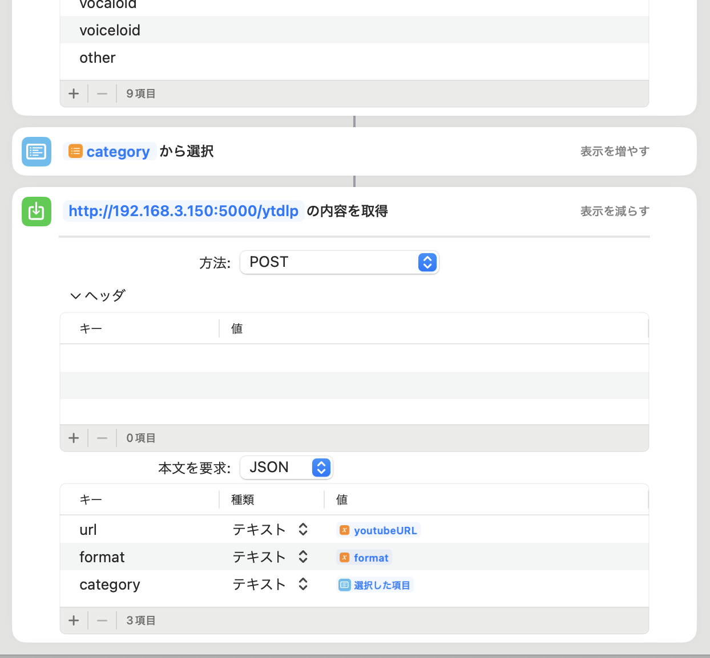

# ytdlp Server

ネットワーク内から yt-dlp を実行する API サーバ。URL を POST すると動画をダウンロードして保存する。

## 導入の流れ

1. （任意）[保存先に NAS を使う](#保存先に-nas-を使う任意)
2. 導入方法を選んで導入する
   - [Docker Compose で使う](#docker-compose-で使う)
   - [Alpine Linux (LXC/ベアメタル) で使う](#alpine-linux-lxcベアメタル-で使う)
3. [動画をダウンロードする](#動画をダウンロードする)

---

## 保存先に NAS を使う（任意）

動画の保存先に NAS (Samba) を使う場合、導入前に、動画を保存するサーバ（LXC の場合は LXC のホスト）でマウントしておく。  
以降、保存先は `/mnt/video` として記載する。

```sh
## Ubuntu
sudo apt install cifs-utils
## Alpine
apk add cifs-utils

sudo mkdir -p /mnt/video
```

`/etc/fstab` に追記する。

```conf
//192.168.3.120/Videos   /mnt/video   cifs  nofail,_netdev,x-systemd.automount,user=<ユーザ名>,password=<パスワード>,file_mode=0666,dir_mode=0777  0  0
```

認証情報を別ファイルにする場合は、`user=...,password=...` を `credentials=/etc/smb-credentials/.pw` に置き換える。

```sh
sudo mkdir -p /etc/smb-credentials/
cat << EOF | sudo tee /etc/smb-credentials/.pw
username=<ユーザ名>
password=<パスワード>
EOF
sudo chmod 600 /etc/smb-credentials/.pw
```

マウントする。

```sh
sudo mount -a
```

---

## Docker Compose で使う

### 使う構成を選ぶ

用途に応じて、使う compose ファイルを 1 つ選ぶ。以降の手順の `<ファイル>` に、選んだファイル名を指定する。

| 構成                | `<ファイル>`                    | API の URL                          |
| ------------------- | ------------------------------- | ----------------------------------- |
| HTTP（基本）        | `docker-compose.yml`            | `http://<IPアドレス>:5000/download` |
| HTTPS（nginx）      | `docker-compose.nginx.yml`      | `https://<IPアドレス>/download`     |
| Cloudflare Tunnel   | `docker-compose.cloudflare.yml` | Cloudflare で設定したホスト名       |

- HTTPS（nginx）は自己署名証明書を使う。
- Cloudflare Tunnel は、ファイル内の `<YOUR_CLOUDFLARE_TOKEN>` をトークンに書き換える。

### 1. Docker をインストールする

```sh
sudo apt update
sudo apt install docker.io
sudo gpasswd --add $USER docker
newgrp docker
```

docker-compose をインストールする。

```sh
sudo curl -SL https://github.com/docker/compose/releases/download/v2.4.1/docker-compose-linux-x86_64 -o /usr/local/bin/docker-compose
sudo chmod +x /usr/local/bin/docker-compose
docker-compose --version
```

### 2. 保存先を設定する

`<ファイル>` の worker の `volumes` を編集する（`<ホスト側>:<コンテナ側>`）。

```yml
worker:
  volumes:
    - /mnt/video:/download
```

### 3. 起動する

```sh
docker-compose -f <ファイル> up -d --build --scale worker=4
```

`--scale worker=N` で worker の数を指定する。

### 4. 動作確認する

```sh
docker-compose -f <ファイル> ps
```

全サービスが `Up` になっていることを確認する。  
`405` が返れば API は動作している（HTTPS の場合は URL を `https://...` にし、`-k` を付ける）。

```sh
curl -s -o /dev/null -w "%{http_code}\n" http://<IPアドレス>:5000/download
```

Redis のキューは `http://<IPアドレス>:5540`（Redis Insight）で確認できる。

### 運用

```sh
## ログを見る
docker-compose -f <ファイル> logs -f

## 更新する
git pull
docker-compose -f <ファイル> up -d --build --scale worker=4

## worker の数を変える
docker-compose -f <ファイル> up -d --scale worker=8

## 再起動する
docker-compose -f <ファイル> restart

## 停止する
docker-compose -f <ファイル> down
```

---

## Alpine Linux (LXC/ベアメタル) で使う

Alpine Linux 3.21 に Docker なしでインストールする。

### 1. 実行環境を用意する

メモリは **1GB 以上**を割り当てる（pot-provider の `npm ci` と canvas のビルドに必要。128MB 程度ではほぼ完了しない）。ディスクは 4GB 以上を推奨する。

**LXC の場合**、コンテナを作成してシェルに入る。

```sh
lxc launch images:alpine/3.21 ytdlp
lxc exec ytdlp -- sh
```

保存先にホストのディレクトリ（[NAS](#保存先に-nas-を使う任意) など）を使う場合は、ホスト側で実行する。

```sh
lxc config device add ytdlp video disk source=/mnt/video path=/mnt/video
## 非特権コンテナで書き込めない場合
lxc config device set ytdlp video shift=true
```

**ベアメタルの場合**、Alpine に root でログインする。

### 2. インストーラを取得する

コンテナ内（ベアメタルは Alpine 上）で実行する。

```sh
wget -O install-alpine.sh https://github.com/nekono-dev/ytdlpServer/releases/latest/download/install-alpine.sh
```

### 3. 設定してインストールする

環境変数に設定値を指定して実行する。指定した値は `/etc/conf.d/ytdlpserver` に保存される。

```sh
WORKER_COUNT=4 DOWNLOAD_DIR=/mnt/video sh install-alpine.sh
```

初回は数分かかる。完了すると API の URL が表示される。

設定値（すべて省略可）:

| 環境変数     | 既定値   | 内容                                        |
| ------------ | -------- | ------------------------------------------- |
| DOWNLOAD_DIR | `/mnt`   | 動画の保存先                                |
| WORKER_COUNT | `1`      | worker の数                                 |
| API_PORT     | `5000`   | API のポート                                |
| SERVER_TTL   | `24`     | API を自動で再起動する間隔（時間）          |
| REDIS_TTL    | `604800` | redis のジョブ情報の保持期間（秒）          |
| RETRY_COUNT  | `5`      | ダウンロードのリトライ回数                  |

全項目は `sh install-alpine.sh --help` で確認できる。

#### 追加する機能を選ぶ

必要な機能の環境変数を、上のコマンドに追加する。組み合わせて使える。

| 機能                    | 環境変数                                         | 接続先                                             |
| ----------------------- | ------------------------------------------------ | -------------------------------------------------- |
| HTTPS（nginx）          | `WITH_NGINX=1`（証明書の CN は `SSL_CN=<ホスト名>`） | `https://<IPアドレス>/download`（自己署名証明書） |
| Cloudflare Tunnel       | `WITH_CLOUDFLARED=1 CLOUDFLARE_TOKEN=<トークン>` | Cloudflare で設定したホスト名                      |
| Redis の Web UI         | `WITH_REDIS_INSIGHT=1`                           | `http://127.0.0.1:5540`（redis-commander）         |

- Cloudflare Tunnel は、Release から取得した `install-alpine.sh` でのみ使える。
- Redis の Web UI はデフォルトで有効
- Redis の Web UI を別のホストから見る場合は `REDIS_UI_HOST=0.0.0.0` を付ける（デフォルト値）

例: HTTPS と Redis の Web UI を追加する。

```sh
WITH_NGINX=1 WITH_REDIS_INSIGHT=1 sh install-alpine.sh
```

### 4. 動作確認する

```sh
rc-status
wget -S -O /dev/null http://127.0.0.1:5000/download
```

`405 METHOD NOT ALLOWED` が返れば API は動作している。

### 運用

```sh
## 設定を変更する（変更する項目だけ指定する。指定しない項目は前回の値のまま）
WORKER_COUNT=8 sh install-alpine.sh

## 設定値の更新は /etc/conf.d/ytdlpserver の編集 + スクリプトの再実行でも対応可能
vi /etc/conf.d/ytdlpserver
sh install-alpine.sh

## 状態を見る
rc-status

## ログを見る
tail -f /var/log/ytdlp-api.log

## 再起動する
rc-service ytdlp-api restart
rc-service ytdlp-worker.1 restart
```

サービス名: `ytdlp-pot` / `ytdlp-api` / `ytdlp-worker.<番号>` / `redis` / `nginx` / `ytdlp-cloudflared` / `ytdlp-redis-ui`

追加した機能を止める場合は、サービスを停止して無効にする。

```sh
rc-service nginx stop
rc-update del nginx
```

---

## 動画をダウンロードする

`/download` に POST する。

```sh
curl -H "Content-Type: application/json" -X POST "http://<IPアドレス>:5000/download" \
  -d '{"url": "https://www.youtube.com/watch?v=XXXXXXXXXX", "options": "--format bv*+ba/best", "savedir": "unsorted"}'
```

HTTPS（nginx）の場合は URL を `https://<IPアドレス>/download` にし、`curl` に `-k` を付ける。

iOS ショートカットなどを作成すると楽に操作できる。

<details><summary>image</summary>



</details>

### リクエストの項目

| 項目      | 型     | 内容                                                           |
| --------- | ------ | -------------------------------------------------------------- |
| url       | string | ダウンロードする動画の URL                                     |
| options   | string | yt-dlp のオプション                                            |
| savedir   | string | 保存先のサブディレクトリ（指定した場合、作成して保存する）     |
| namefield | string | 保存ファイル名のテンプレート（例: `%(title)s-%(id)s`）         |

`namefield` は yt-dlp の `%(key)s` 形式で指定する。拡張子は自動で付く。

### オプションの例

`options` には yt-dlp のオプションを指定する。

| やりたいこと                         | オプション                                                             |
| ------------------------------------ | ---------------------------------------------------------------------- |
| YouTube の音声を日本語にする         | `--extractor-args youtube:lang=ja`                                     |
| ファイル名の文字化けを防ぐ           | `--windows-filenames`                                                  |
| ログインして取得する                 | `-u <ユーザ名> -p <パスワード>`                                        |
| 出力形式を mp4 にする                | `--merge-output-format mp4`                                            |
| コーデックを avc1 (mp4) にする       | `-f "bestvideo[vcodec^=avc1][ext=mp4]+bestaudio[ext=m4a]"`             |
| 同じファイルを再ダウンロードする     | `--force-overwrites`                                                   |

---

## トラブルシューティング

### `yt-dlp probe failed; wait restart yt-dlp.` が返る

しばらく待って、もう一度リクエストする。繰り返す場合は URL と `options` を確認する。

### `この動画はご覧いただけません` になる（YouTube）

API と worker を再起動して、もう一度リクエストする。

```sh
## Docker Compose
docker-compose -f <ファイル> restart
## Alpine
rc-service ytdlp-pot restart
rc-service ytdlp-api restart
rc-service ytdlp-worker.1 restart
```

### `client and server have different API versions`（Docker Compose）

`/etc/docker/daemon.json` に追記して、Docker を再起動する。

```diff
  {
    ...
+   "min-api-version": "1.32"
    ...
  }
```

### インストーラが途中で失敗する（Alpine）

- `github.com` に接続できるか確認する。
- もう一度 `sh install-alpine.sh` を実行する（途中からやり直せる）。
- サービスが起動しない場合は `/var/log/ytdlp-<サービス名>.log` を確認する。
