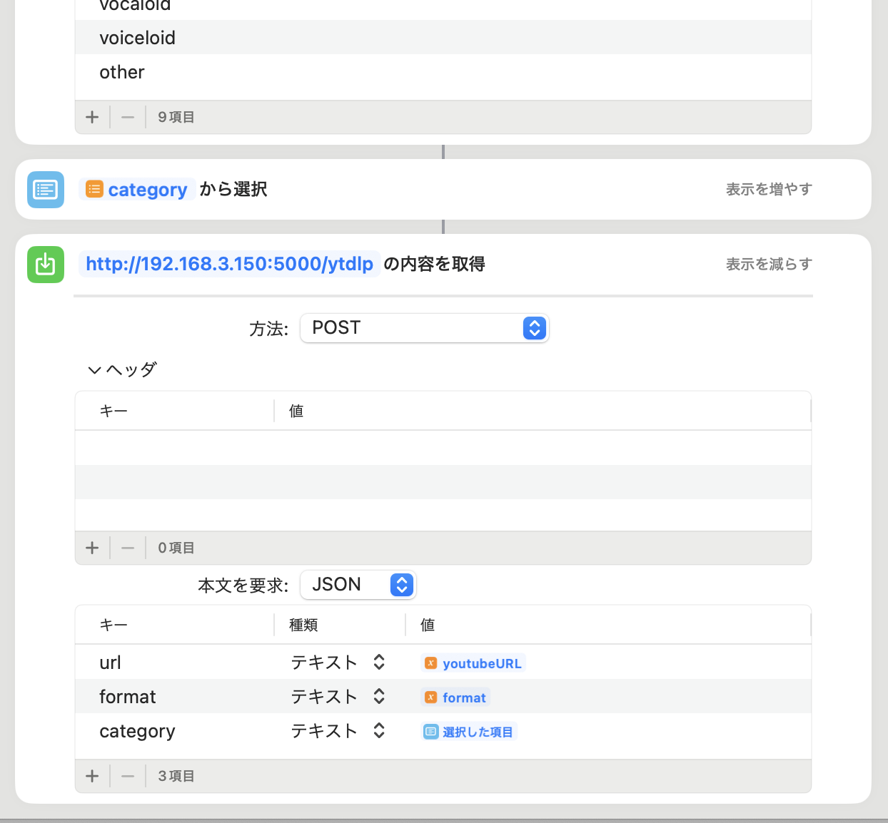

# ytdlp Server

ネットワーク内から yt-dlp を実行する API サーバ。URL を POST すると動画をダウンロードして保存する。

## 導入の流れ

1. （任意）[保存先に NAS を使う](#保存先に-nas-を使う任意)
2. 導入方法を選んで導入する
   - [Docker Compose で使う](#docker-compose-で使う)
   - [Alpine Linux (LXC/ベアメタル) で使う](#alpine-linux-lxcベアメタル-で使う)
3. [動画をダウンロードする](#動画をダウンロードする)

---

## 保存先に NAS を使う（任意）

動画の保存先に NAS (Samba) を使う場合、導入前に、動画を保存するサーバ（LXC の場合は LXC のホスト）でマウントしておく。  
以降、保存先は `/mnt/video` として記載する。

```sh
## Ubuntu
sudo apt install cifs-utils
## Alpine
apk add cifs-utils

sudo mkdir -p /mnt/video
```

`/etc/fstab` に追記する。

```conf
//192.168.3.120/Videos   /mnt/video   cifs  nofail,_netdev,x-systemd.automount,user=<ユーザ名>,password=<パスワード>,file_mode=0666,dir_mode=0777  0  0
```

認証情報を別ファイルにする場合は、`user=...,password=...` を `credentials=/etc/smb-credentials/.pw` に置き換える。

```sh
sudo mkdir -p /etc/smb-credentials/
cat << EOF | sudo tee /etc/smb-credentials/.pw
username=<ユーザ名>
password=<パスワード>
EOF
sudo chmod 600 /etc/smb-credentials/.pw
```

マウントする。

```sh
sudo mount -a
```

---

## Docker Compose で使う

### 使う構成を選ぶ

用途に応じて、使う compose ファイルを 1 つ選ぶ。以降の手順の `<ファイル>` に、選んだファイル名を指定する。

| 構成              | `<ファイル>`                    | API の URL                          |
| ----------------- | ------------------------------- | ----------------------------------- |
| HTTP（基本）      | `docker-compose.yml`            | `http://<IPアドレス>:5000/download` |
| HTTPS（nginx）    | `docker-compose.nginx.yml`      | `https://<IPアドレス>/download`     |
| Cloudflare Tunnel | `docker-compose.cloudflare.yml` | Cloudflare で設定したホスト名       |

- HTTPS（nginx）は自己署名証明書を使う。
- Cloudflare Tunnel は、ファイル内の `<YOUR_CLOUDFLARE_TOKEN>` をトークンに書き換える。

### 1. Docker をインストールする

```sh
sudo apt update
sudo apt install docker.io
sudo gpasswd --add $USER docker
newgrp docker
```

docker-compose をインストールする。

```sh
sudo curl -SL https://github.com/docker/compose/releases/download/v2.4.1/docker-compose-linux-x86_64 -o /usr/local/bin/docker-compose
sudo chmod +x /usr/local/bin/docker-compose
docker-compose --version
```

### 2. 保存先を設定する

`<ファイル>` の `dispatcher` の `volumes` を編集する（`<ホスト側>:<コンテナ側>`）。worker は、ジョブがあるときだけ dispatcher が起動する（常駐しない）ため、`worker` サービス自体は無い。

```yml
dispatcher:
  volumes:
    - /mnt/video:/download
```

### 3. 起動する

```sh
docker-compose -f <ファイル> up -d --build
```

同時に動く worker の最大数は `WORKER_MAX`（既定 1）で指定する。

```sh
WORKER_MAX=4 docker-compose -f <ファイル> up -d --build
```

### 4. 動作確認する

```sh
docker-compose -f <ファイル> ps
```

全サービスが `Up` になっていることを確認する。  
`405` が返れば API は動作している（HTTPS の場合は URL を `https://...` にし、`-k` を付ける）。

```sh
curl -s -o /dev/null -w "%{http_code}\n" http://<IPアドレス>:5000/download
```

Redis のキューは `http://<IPアドレス>:5540`（Redis Insight）で確認できる。

### 運用

```sh
## ログを見る
docker-compose -f <ファイル> logs -f

## 更新する
git pull
docker-compose -f <ファイル> up -d --build

## worker の最大数を変える
WORKER_MAX=8 docker-compose -f <ファイル> up -d

## 再起動する
docker-compose -f <ファイル> restart

## 停止する
docker-compose -f <ファイル> down
```

---

## Alpine Linux (LXC/ベアメタル) で使う

Alpine Linux 3.21 に Docker なしでインストールする。

### インストール

#### 1. 実行環境を用意する

メモリは **1GB 以上**を割り当てる（pot-provider の `npm ci` と canvas のビルドに必要。128MB 程度ではほぼ完了しない）。ディスクは 4GB 以上を推奨する。ログイン用ブラウザ（既定で有効）を使う場合は、メモリ 2GB 以上・ディスクの空き 1GB 以上を推奨する（[詳細](#ログイン用ブラウザの設定)）。Redis Insight をビルドする場合は、ビルド時のみ追加の要件がある（[Redis の Web UI](#redis-web-uiの設定)を参照）。

**LXC の場合**、コンテナを作成してシェルに入る。

```sh
lxc launch images:alpine/3.21 ytdlp
lxc exec ytdlp -- sh
```

保存先にホストのディレクトリ（[NAS](#保存先に-nas-を使う任意) など）を使う場合は、ホスト側で実行する。

```sh
lxc config device add ytdlp video disk source=/mnt/video path=/mnt/video
## 非特権コンテナで書き込めない場合
lxc config device set ytdlp video shift=true
```

**ベアメタルの場合**、Alpine に root でログインする。

#### 2. インストーラを取得する

コンテナ内（ベアメタルは Alpine 上）で実行する。

```sh
wget -O install.sh https://github.com/nekono-dev/ytdlpServer/releases/latest/download/install.sh
```

#### 3. 設定してインストールする

環境変数に設定値を指定して実行する。指定した値は `/etc/conf.d/ytdlpserver` に保存される。

```sh
WORKER_MAX=4 DOWNLOAD_DIR=/mnt/video sh install.sh
```

初回は数分かかる。完了すると API の URL が表示される。

設定値はすべて省略可。全項目は `sh install.sh --help` でも確認できる。

| 環境変数               | 既定値                   | 内容                                                                               |
| ---------------------- | ------------------------ | ---------------------------------------------------------------------------------- |
| DOWNLOAD_DIR           | `/mnt`                   | 動画の保存先                                                                       |
| COOKIE_DIR             | `$INSTALL_DIR/cookies`   | cookie プロファイル（ログインセッション）の保存先                                  |
| WORKER_MAX             | `1`                      | 同時に動く worker の最大数（旧 `WORKER_COUNT` を別名として引き継ぐ）               |
| API_PORT               | `5000`                   | API のポート                                                                       |
| POT_PORT               | `4416`                   | PO Token プロバイダのポート（127.0.0.1 限定）                                      |
| REDIS_TTL              | `604800`                 | redis のジョブ情報の保持期間（秒）                                                 |
| RETRY_COUNT            | `5`                      | ダウンロードのリトライ回数                                                         |
| YTDLP_REPO             | `yt-dlp/yt-dlp`          | yt-dlp の取得元（GitHub リポジトリ）                                               |
| UPDATE_INTERVAL        | `21600`                  | yt-dlp の新版の確認間隔（秒）                                                      |
| UPDATE_RETRY_INTERVAL  | `1800`                   | 確認・適用に失敗した後の再確認の間隔（秒）                                         |
| UPDATE_COOLDOWN        | `1800`                   | probe 失敗による確認依頼の最短間隔（秒）                                           |
| KEEP_VERSIONS          | `2`                      | 導入先に残す yt-dlp の版数                                                         |
| DISPATCH_SCAN_INTERVAL | `30`                     | dispatcher がジョブを定期確認する間隔（秒）                                        |
| LEASE_TTL              | `60`                     | worker の生存確認（リース）の有効期間（秒）                                        |
| HEARTBEAT_INTERVAL     | `10`                     | worker がリースを更新する間隔（秒）                                                |
| STOP_GRACE             | `20`                     | 停止指示から yt-dlp を強制終了するまでの猶予（秒）                                 |
| INPROGRESS_STALE       | `21600`                  | 所有者不明の in_progress ジョブを回収するまでの時間（秒）                          |
| INSTALL_DIR            | `/opt/ytdlpserver`       | ソースの取得先（`install.sh` がここへ clone する）。venv 等もこの直下に展開される  |
| WITH_NGINX             | `0`                      | `1` で HTTPS（nginx）を有効化。[詳細](#httpsnginx)                                 |
| SSL_CN                 | `localhost`              | 自己署名証明書の CN。[詳細](#httpsnginx)                                           |
| WITH_CLOUDFLARED       | `0`                      | `1` で Cloudflare Tunnel を有効化。[詳細](#cloudflare-tunnel)                      |
| CLOUDFLARE_TOKEN       | なし                     | Cloudflare Tunnel のトークン（`WITH_CLOUDFLARED=1` で必須）                        |
| WITH_REDIS_INSIGHT     | `1`                      | `1` で Redis◊ の Web UI（5540）を有効化。[詳細](#redis-web-uiの設定)               |
| REDIS_UI               | `insight`                | Web UI の種類（`insight` / `commander`）。[詳細](#redis-web-uiの設定)              |
| REDIS_INSIGHT_VERSION  | `3.8.0`                  | ビルドする Redis Insight のタグ。[詳細](#redis-web-uiの設定)                       |
| RI_BUILD_STORAGE       | `auto`                   | Redis Insight のビルド先（`auto` / `tmpfs` / `disk`）。[詳細](#redis-web-uiの設定) |
| REDIS_UI_HOST          | `0.0.0.0`                | Web UI の待ち受けアドレス                                                          |
| WITH_BROWSER           | `1`                      | `1` でログイン用ブラウザ（Chromium）を有効化。[詳細](#ログイン用ブラウザの設定)    |
| BROWSER_PORT           | `8080`                   | ログイン用ブラウザ画面のポート                                                     |
| BROWSER_UI_URL         | サーバの IP から自動検出 | 401 応答の `login_url` に使う URL。[詳細](#ログイン用ブラウザの設定)               |
| SESSION_TIMEOUT        | `900`                    | ログインセッションの自動終了までの秒数                                             |
| BROWSER_LANG           | `ja,en-US,en`            | ログイン用ブラウザの言語設定                                                       |
| BROWSER_TZ             | `Asia/Tokyo`             | ログイン用ブラウザのタイムゾーン                                                   |

例: HTTPS を追加し、Redis の Web UI は軽量な commander にする。

```sh
WITH_NGINX=1 REDIS_UI=commander sh install.sh
```

##### HTTPS（nginx）の設定

`WITH_NGINX=1` で nginx（443）を導入し、HTTPS を有効にする。自己署名証明書を使い、証明書の CN は `SSL_CN=<ホスト名>` で指定する。

API の URL は `https://<IPアドレス>/download` になる。

##### Cloudflare Tunnelの設定

`WITH_CLOUDFLARED=1 CLOUDFLARE_TOKEN=<トークン>` で Cloudflare Tunnel を有効にする。

- インストール時に、GitHub Releases から cloudflared の最新版を取得し、GitHub API が返すダイジェスト（sha256）と照合してから導入する。

##### Redis Web UIの設定

`WITH_REDIS_INSIGHT=1`（既定で有効）で Redis の Web UI を導入する。アクセス先は `http://<IPアドレス>:5540`。`REDIS_UI_HOST` で待ち受けアドレスを変更できる。

- `REDIS_UI=commander` を指定すると、最初から軽量な redis-commander を使う。
- Redis Insight は SSPL ライセンスのため、ビルド済みバイナリは配布しない。インストーラーが公式 GitHub のソース（`REDIS_INSIGHT_VERSION` のタグ）を取得し、その場でビルドする。
  - 要件: メモリ 2GB 以上、Node.js 24 以上（Alpine 3.23 以降）、初回の所要時間は約 6 分（ビルド済みなら再実行時はスキップ）
  - 要件を満たさない場合やビルドに失敗した場合は、警告を出して redis-commander で継続する
- **ビルド中はピークで約 9.5GB の作業領域を使う**（ソースと `node_modules` 約 3.3GB、yarn キャッシュ約 5.7GB）。作業領域はビルド後にすべて削除され、残るのは約 0.3GB のみ。置き場所は `RI_BUILD_STORAGE` で選ぶ。

| `RI_BUILD_STORAGE` | 作業領域                                                    | 必要な資源                                                                                |
| ------------------ | ----------------------------------------------------------- | ----------------------------------------------------------------------------------------- |
| `auto`（既定）     | メモリが足りれば tmpfs、足りない・マウントできなければ disk | 下記のいずれか                                                                            |
| `tmpfs`            | メモリ上（tmpfs）                                           | **インストール時のみ メモリ 12GB 程度**。ディスクは使わない。ビルド後にメモリは解放される |
| `disk`             | ディスク                                                    | **空き容量 10GB 程度**（ビルド中のみ）                                                    |

- LXC の Proxmox でメモリ 2GB・ディスク 2GB のような小さなコンテナに入れる場合は、インストール時だけメモリを増やして（`pct set <CTID> -memory 12288`）`RI_BUILD_STORAGE=tmpfs` でビルドし、完了後に元のメモリへ戻せる。ディスクを増やせるなら `RI_BUILD_STORAGE=disk` でもよい。
- tmpfs をマウントできない環境（権限のない LXC など）では、`auto` は disk にフォールバックし、`tmpfs` を明示した場合は警告を出して commander で継続する。

例: ディスクを使わず、メモリ上でビルドする。

```sh
RI_BUILD_STORAGE=tmpfs sh install.sh
```

##### ログイン用ブラウザの設定

`WITH_BROWSER=1`（既定で有効）で、ログインが必要なサイトの cookie を取得するためのブラウザ（Chromium）を導入する。詳しい使い方は[ログインが必要な動画を取得する](#ログインが必要な動画を取得する)を参照。

- 要件: メモリ 2GB 以上・ディスクの空き 1GB 以上を推奨（導入自体は約 0.8GB、ログイン中の Chromium はピークで 1.5GB 程度のメモリを使う）。
  満たさない場合は、`WITH_BROWSER=1` を明示していなければ自動で無効化（警告を出したうえで継続）し、明示している場合は警告のみ出して続行する。
- アクセス先は `http://<IPアドレス>:8080`。`BROWSER_PORT` でポートを変更できる。
- `BROWSER_UI_URL`（401 応答の `login_url` に使う URL）は、サーバの外向き IP から自動で組み立てられる。手動で指定する場合や、nginx・Cloudflare Tunnel 経由で公開する場合は明示する。
- 画面（8080）に認証は無い。LAN 内だけで使い、ポートを外部へ公開しない。Cloudflare Tunnel の対象にも含めない。
- 不要な場合は `WITH_BROWSER=0` で無効化する。

#### 4. 動作確認する

```sh
rc-status
wget -S -O /dev/null http://127.0.0.1:5000/download
```

`405 METHOD NOT ALLOWED` が返れば API は動作している。

### 設定を変更する方法

環境変数を指定して再実行する（変更する項目だけ指定すればよい。指定しない項目は前回の値のまま）。

```sh
WORKER_MAX=8 sh install.sh
```

`/etc/conf.d/ytdlpserver` を直接編集してから再実行してもよい。

```sh
vi /etc/conf.d/ytdlpserver
sh install.sh
```

バージョンアップする場合は、最新のインストーラを取得して再実行する。設定・cookie（ログインセッション）・Redis のデータは維持される。

```sh
wget -O install.sh https://github.com/nekono-dev/ytdlpServer/releases/latest/download/install.sh
sh install.sh
```

- `install.sh` はビルド時のコミットに固定されている（ブランチ・タグの付け替えとは食い違わない）ため、更新のたびに取得し直す。
- `REDIS_INSIGHT_VERSION` など、リリースに追従させる項目は、環境変数で明示しない限り新しいインストーラの既定値へ自動で切り替わる（保存済みの値に固定され続けることはない）。
- 使われなくなった設定（旧バージョンの名残）は、実行時に警告を出したうえで自動的に削除される。
- 大きくバージョンをまたぐ場合や、通常のアップデートでうまくいかない場合は、下記の[アンインストール](#アンインストールする方法)を挟んでから新しいインストーラを実行する。

状態を見る・ログを見る・再起動する。

```sh
rc-status

tail -f /var/log/ytdlp-api.log

rc-service ytdlp-api restart
rc-service ytdlp-dispatcher restart
```

サービス名: `ytdlp-pot` / `ytdlp-api` / `ytdlp-dispatcher`（worker はここから起動される） / `redis` / `nginx` / `ytdlp-cloudflared` / `ytdlp-redis-ui` / `ytdlp-browser`

追加した機能を止める場合は、サービスを停止して無効にする。

```sh
rc-service nginx stop
rc-update del nginx
```

### アンインストールする方法

`--uninstall` は、アプリ本体（venv・pot-provider・yt-dlp・Redis Insight・OpenRC サービス）だけを削除する。ソース（取得先の `INSTALL_DIR`）・設定（`/etc/conf.d/ytdlpserver`）・cookie・Redis のデータ（ジョブキュー）・動画の保存先はそのまま残る。

```sh
sh install.sh --uninstall
```

続けて新しいインストーラを実行すれば、設定を引き継いで安全にバージョンアップできる。

```sh
wget -O install.sh https://github.com/nekono-dev/ytdlpServer/releases/latest/download/install.sh
sh install.sh
```

---

## 動画をダウンロードする

`/download` に POST する。

```sh
curl -H "Content-Type: application/json" -X POST "http://<IPアドレス>:5000/download" \
  -d '{"url": "https://www.youtube.com/watch?v=XXXXXXXXXX", "options": "--format bv*+ba/best", "savedir": "unsorted"}'
```

HTTPS（nginx）の場合は URL を `https://<IPアドレス>/download` にし、`curl` に `-k` を付ける。

iOS ショートカットなどを作成すると楽に操作できる。

<details><summary>image</summary>



</details>

### リクエストの項目

| 項目         | 型     | 内容                                                                                                                         |
| ------------ | ------ | ---------------------------------------------------------------------------------------------------------------------------- |
| url          | string | ダウンロードする動画の URL                                                                                                   |
| options      | string | yt-dlp のオプション                                                                                                          |
| savedir      | string | 保存先のサブディレクトリ（指定した場合、作成して保存する）                                                                   |
| namefield    | string | 保存ファイル名のテンプレート（例: `%(title)s-%(id)s`）                                                                       |
| auth_profile | string | 使う cookie プロファイル名。省略すると URL のサイトから自動で選ぶ（[ログインが必要な動画](#ログインが必要な動画を取得する)） |

`namefield` は yt-dlp の `%(key)s` 形式で指定する。拡張子は自動で付く。

### オプションの例

`options` には yt-dlp のオプションを指定する。

| やりたいこと                     | オプション                                                                              |
| -------------------------------- | --------------------------------------------------------------------------------------- |
| YouTube の音声を日本語にする     | `-f "bestaudio[ext=m4a][language^=ja]"`                                                 |
| タイトル等を日本語の翻訳にする   | `--extractor-args youtube:lang=ja`（音声は変わらない）                                  |
| ファイル名の文字化けを防ぐ       | `--windows-filenames`                                                                   |
| ログインして取得する             | `options` ではなく cookie プロファイルを使う（[後述](#ログインが必要な動画を取得する)） |
| 出力形式を mp4 にする            | `--merge-output-format mp4`                                                             |
| コーデックを avc1 (mp4) にする   | `-f "bestvideo[vcodec^=avc1][ext=mp4]"`                                                 |
| 同じファイルを再ダウンロードする | `--force-overwrites`                                                                    |

---

## ログインが必要な動画を取得する

一部のサイトは、ユーザ名とパスワードでは yt-dlp からログインできない。
このサーバは、ブラウザでログインしたときの **cookie** を、サイトごとの **プロファイル** として保存しておき、取得に使う。

1. ブラウザでログインして、プロファイルを保存する（[下記](#ブラウザでログインして-cookie-を保存する)）。
2. いつもどおり `/download` に URL を送る。URL のサイトに対応するプロファイルが保存されていれば、自動で使われる。

| プリセット（最初から選べるサイト） | プロファイル名 | 対象のドメイン                    |
| ---------------------------------- | -------------- | --------------------------------- |
| YouTube                            | `youtube`      | youtube.com, youtu.be, google.com |
| ニコニコ                           | `niconico`     | nicovideo.jp, nico.ms             |
| Instagram                          | `instagram`    | instagram.com                     |
| X (Twitter)                        | `x`            | x.com, twitter.com                |
| Bilibili                           | `bilibili`     | bilibili.com, b23.tv              |

それ以外のサイトも、ログイン画面で「新しいサイトを追加」から使える。一度保存すると、次回からプルダウンで選べ、自動選択の対象にもなる。

- 自動で選んだプロファイルの cookie が未保存・失効中でも、ログイン不要の動画は取得できる。
- 使うプロファイルを明示したい場合は、リクエストに `auth_profile` を指定する（自動選択より優先）。`/schedule` でも指定できる。

```sh
curl -H "Content-Type: application/json" -X POST "http://<IPアドレス>:5000/download" \
  -d '{"url": "https://www.nicovideo.jp/watch/sm00000000", "auth_profile": "niconico"}'
```

- `options` の `-u` / `-p`（`--username` / `--password`）、`--cookies`、`--netrc*` は使えない（400 になる）。
- cookie は `<プロファイル名>.txt` として保存される。保存先は Docker Compose では `cookies/`、Alpine では `/opt/ytdlpserver/cookies/`（`COOKIE_DIR` で変更可）。
  cookie はパスワードと同じ扱いにし、他人に渡さず、Git にもコミットしない（`cookies/` は `.gitignore` 済み）。
- ログインには、普段使いとは別のアカウントを使うことを勧める（サイトによっては、別環境での cookie の利用でアカウントが保護・制限されることがある）。

### ブラウザでログインして cookie を保存する

ブラウザでログインするだけで、cookie がプロファイルとして保存される。cookies.txt を書き出す必要はない。
スマートフォンでも PC でも使える。サーバ上のブラウザの画面が、この端末の画面の大きさで表示される。

Alpine インストーラは既定でこの機能を導入し（[詳細](#ログイン用ブラウザの設定)）、`BROWSER_UI_URL` もサーバの IP から自動で設定される。Docker Compose の場合は、下記の手順が必要。

1. （推奨・Docker Compose のみ）`.env` に `BROWSER_UI_URL=http://<サーバのIPアドレス>:8080` を書いて、起動し直す。
   401 の `login_url` から、この画面を開けるようになる。
2. ブラウザで `http://<サーバのIPアドレス>:8080/` を開く（`login_url` を開くと、該当するプロファイルが選ばれた状態で開く）。
3. プロファイル（サイト）をプルダウンから選び、「ログイン用ブラウザを開く」を押す。
   - 一覧に無いサイトは「＋ 新しいサイトを追加…」を選び、プロファイル名（英数字・`-`・`_`、64 文字まで）とログイン画面の URL を入力する。
   - プルダウンの ✓ は保存済み。選ぶと保存日時が表示される。
4. 表示された画面でログインする。CAPTCHA や 2 段階認証もこの画面で操作する。
   - 入力欄をタップすると、端末のキーボードが出る（⌨ でも開閉できる）。
   - パスワードマネージャの値は「貼付」から送る（入力欄をタップしてから、貼り付けて「送信」）。
   - ← は戻る、↻ は再読み込み。外部アカウントでのログインなどで新しい画面が開くと、表示が切り替わる。
5. ログインが終わったら「保存」を押す。`cookies/<プロファイル名>.txt` に保存される。

- 保存されるのは、そのサイトの対象ドメインの cookie だけ（追加したサイトは、入力した URL の登録ドメイン配下）。同じプロファイルで保存し直すと上書きされる（再ログイン）。
- 追加したサイトは「削除」で消せる（保存した cookie も消える）。URL を変えたい場合は、削除して追加し直す。プリセットは削除できない。
- 同時に使えるのは 1 件。`SESSION_TIMEOUT`（秒、既定 900）で自動終了する。保存・中止・時間切れのあと、ブラウザとその履歴は破棄される。
- 画面（8080）に認証は無い。LAN 内だけで使い、ポートを外部へ公開しない。Cloudflare Tunnel の対象にも含めない。

### プロファイルの一覧

```sh
curl "http://<IPアドレス>:5000/auth/profiles"
```

cookie を保存済みのプロファイルの `profile`（名前）・`label`（表示名）・`domains`・`status`・`updated_at`・`login_url` を返す。`status` は `valid`（有効）か `expired`（失効を検知済み）。cookie の中身は返さない。

### ログインが必要な場合の応答

cookie が未指定・未登録・失効しているときは、リクエストの時点で **HTTP 401** が返る。

```json
{
  "error": "login_required",
  "reason": "cookie_expired",
  "auth_profile": "niconico",
  "message": "プロファイル 'niconico' の cookie が無効です。再ログインして cookie を更新してください。",
  "login_url": "http://<サーバのIPアドレス>:8080/?profile=niconico&start_url=https%3A%2F%2Fwww.nicovideo.jp%2F"
}
```

| 項目         | 内容                                                                    |
| ------------ | ----------------------------------------------------------------------- |
| reason       | 下表                                                                    |
| auth_profile | 対象のプロファイル（明示指定、または自動で選んだもの）。無ければ `null` |
| login_url    | 再ログイン用の画面の URL。設定されていなければ `null`                   |

| reason            | 意味                                                                         |
| ----------------- | ---------------------------------------------------------------------------- |
| `cookie_missing`  | ログインが必要だが、対応するプロファイルが無い（新しいサイトとして追加する） |
| `profile_unknown` | プロファイルの cookie が保存されていない                                     |
| `cookie_expired`  | cookie が失効している                                                        |

- cookie を更新すると、サーバを再起動しなくても `valid` に戻る。
- キューに積んだ後で cookie が失効した場合は、ジョブが失敗し、ジョブ情報に `error_code=login_required` が入る。cookie を更新するまで自動リトライはしない。
- `/download/scheduled` で 401 になった予約は、削除されずに残る。

---

## トラブルシューティング

### `login_required`（HTTP 401）が返る

プロファイルの cookie が未保存または失効している。[ログインが必要な場合の応答](#ログインが必要な場合の応答)の `login_url` を開き、ログインして保存し直す。

### X のログインで `We've temporarily limited your login. Please try again later.` と表示され、パスワード欄が出ない

X 側が、このサーバのブラウザからのログインを制限している。ログイン画面で、実在するユーザ名を送ったときだけ出る（存在しないユーザ名では出ない）。

原因は、**ブラウザのタイムゾーンが、サーバの外向き IP の所在地と食い違っていること**（UTC のまま、IP は日本、など）。次のように `TZ` を IP の所在地に合わせて、`browser` を作り直す。

```sh
# .env（compose ファイルと同じ場所）
TZ=Asia/Tokyo
BROWSER_LANG=ja,en-US,en
```

```sh
docker compose up -d --build browser
```

- 既定は `Asia/Tokyo`（日本語）。海外のサーバや VPN 経由で出ている場合は、その所在地のタイムゾーン（例: `America/New_York`）と言語（例: `en-US,en`）にする。
- `TZ` が UTC のままだと、`browser` のログに `WARNING: TZ is UTC` が出る。
- 制限された直後は、設定を直しても、しばらく同じ表示になることがある。試行を繰り返さず、時間をあけて試す。

### `yt-dlp probe failed; requested a yt-dlp update check.` が返る

yt-dlp が対応していない URL・動画である可能性がある。しばらく待って、もう一度リクエストする（dispatcher が新版の確認を行う。新版があれば自動で切り替わる）。繰り返す場合は URL と `options` を確認する。

### `この動画はご覧いただけません` になる（YouTube）

もう一度リクエストする（yt-dlp の新版が自動で使われる）。改善しない場合は pot-provider を再起動する。

```sh
## Docker Compose
docker-compose -f <ファイル> restart pot-provider
## Alpine
rc-service ytdlp-pot restart
```

### `client and server have different API versions`（Docker Compose）

`/etc/docker/daemon.json` に追記して、Docker を再起動する。

```diff
  {
    ...
+   "min-api-version": "1.32"
    ...
  }
```

### インストーラが途中で失敗する（Alpine）

- `github.com` に接続できるか確認する。
- もう一度 `sh install.sh` を実行する（途中からやり直せる）。
- サービスが起動しない場合は `/var/log/ytdlp-<サービス名>.log` を確認する。
