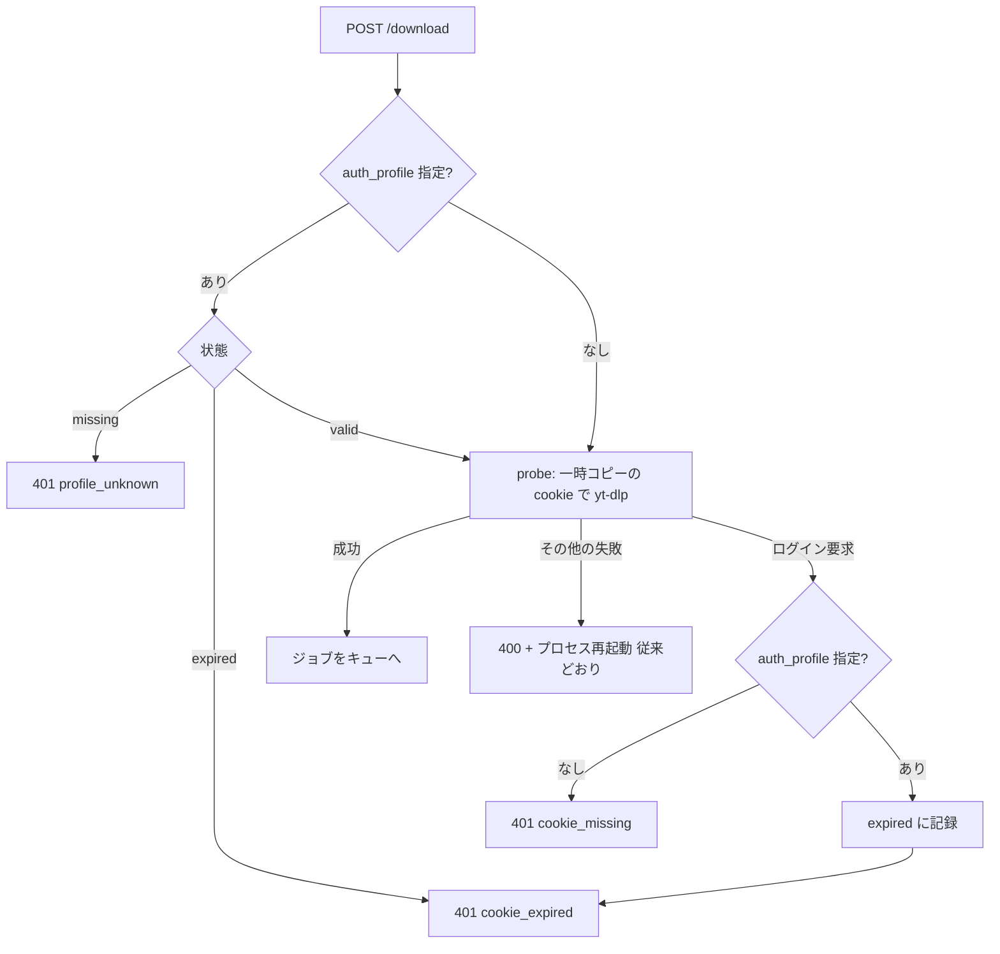

# 設計（apiServer）

全体の構成とアプリ間インターフェース（cookie ストア、プロファイルの状態）は [../design.md](../design.md)。

## cookie セッション認証

### Phase 1: cookie の利用とログイン要求の通知（実装済み）

#### インターフェース

| 項目 | 内容 |
|---|---|
| `POST /download`, `POST /schedule` | `auth_profile`（任意、`[A-Za-z0-9_-]{1,64}`、空文字は未指定）を受け付ける |
| `GET /auth/profiles` | `[{profile, status, updated_at, login_url}]`。cookie の中身は返さない |
| 禁止オプション | `options` に `--cookies` `--cookies-from-browser` `-u` `--username` `-p` `--password` `--twofactor` `-n` `--netrc*` があると 400。応答にはオプション名だけを含め、値は含めない |

#### ログイン要求（HTTP 401）

```json
{"error": "login_required", "reason": "cookie_expired", "auth_profile": "nico",
 "message": "…（日本語）", "login_url": null}
```

| reason | 条件 | probe の実行 |
|---|---|---|
| `cookie_missing` | `auth_profile` 未指定で、yt-dlp がログイン要求を返した | する |
| `profile_unknown` | 指定プロファイルの cookie ファイルが無い | しない |
| `cookie_expired` | プロファイルが `expired`、または probe がログイン要求を返した | 失効中はしない |



- ログイン要求の判定は `classify_login_required()`（yt-dlp のエラー文の部分一致）。実測した文言は下表。

  | 状況 | yt-dlp の出力（ニコニコ） |
  |---|---|
  | cookie なし | `Sensitive content, login required. Use --cookies, ...` |
  | cookie 無効 | `Invalid session, re-login required` |

- ログイン要求では、プロセスの再起動（`os._exit`）を行わない。その他の probe 失敗は従来どおり 400 と再起動。
- 予約実行で 401 になった予約は、`lpush` で先頭へ戻し、401 をそのまま返す。
- `auth_profile` は、ジョブ（キューの JSON）と予約（`ytdlp:requests`）に含める。

#### cookie の扱い

- probe は cookie の一時コピーを `--cookies` に渡す。終了時に内容が変わっていれば、一時ファイル経由で置き換えて書き戻す（失敗した場合も）。一時ファイルは必ず削除する。
- 共通処理は `src/cookies.py`。workerServer と同一内容（テストで一致を確認する）。

### Phase 2: 再ログイン用画面への誘導

| 項目 | 内容 |
|---|---|
| `login_url` | 環境変数 `BROWSER_UI_URL` があるとき `<BROWSER_UI_URL>/?profile=<プロファイル名>&start_url=<リクエスト URL の origin>`。無いときは `null` |
| 適用範囲 | 401 の全 reason、`GET /auth/profiles` の各行 |

- プロファイル名は URL エンコードする。`auth_profile` 未指定（`cookie_missing`）でも、`start_url` は付ける（`profile` は空）。
- cookie を登録する API は追加しない（A8）。
