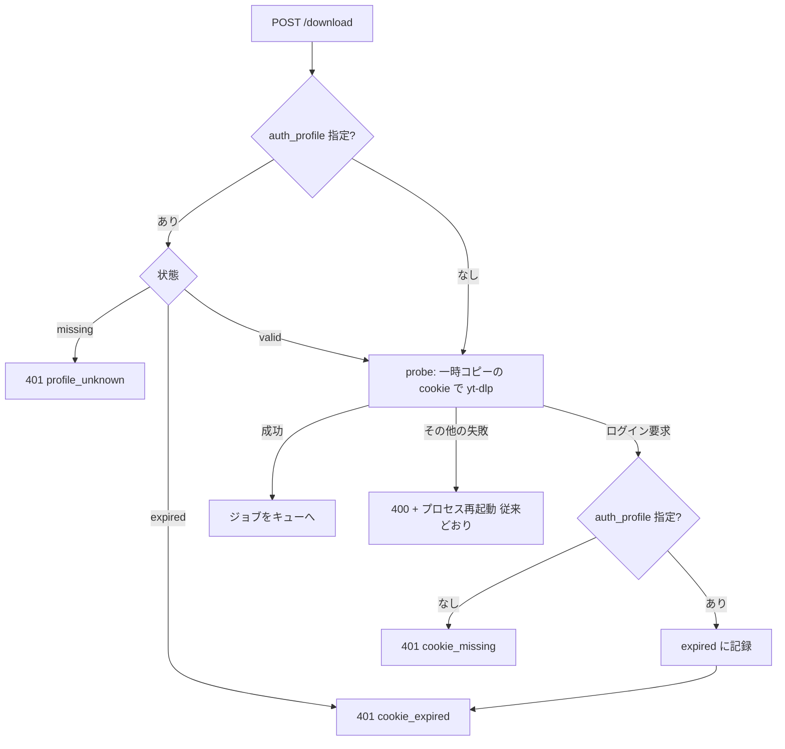
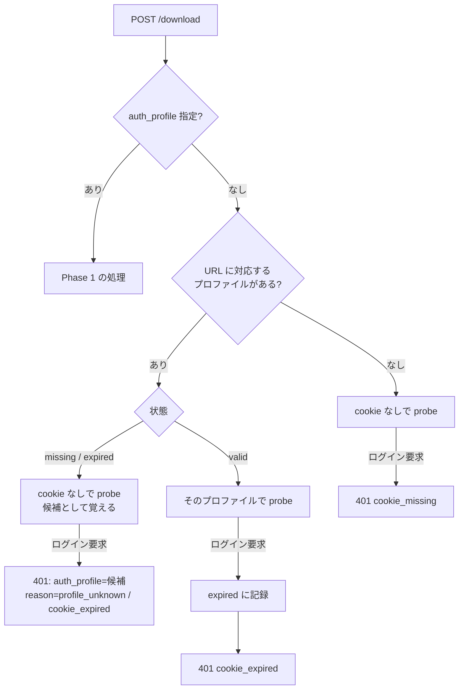
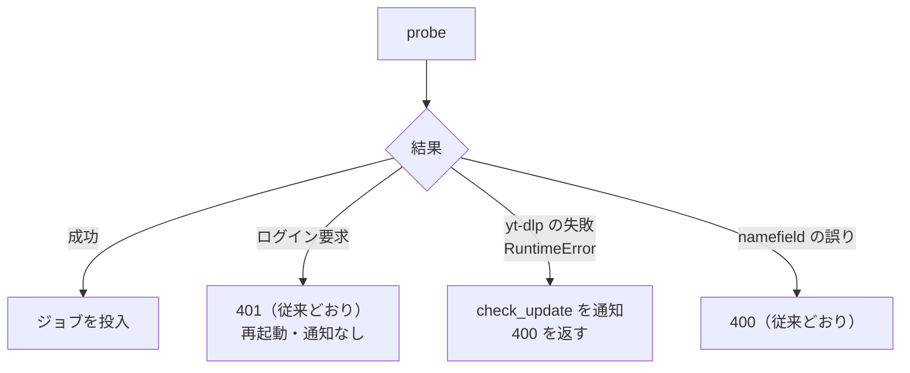

# 設計（apiServer）

全体の構成とアプリ間インターフェース（cookie ストア、プロファイルの状態）は [../design.md](../design.md)。

## cookie セッション認証

### Phase 1: cookie の利用とログイン要求の通知（実装済み）

#### インターフェース

| 項目 | 内容 |
|---|---|
| `POST /download`, `POST /schedule` | `auth_profile`（任意、`[A-Za-z0-9_-]{1,64}`、空文字は未指定）を受け付ける |
| `GET /auth/profiles` | `[{profile, status, updated_at, login_url}]`。cookie の中身は返さない |
| 禁止オプション | `options` に `--cookies` `--cookies-from-browser` `-u` `--username` `-p` `--password` `--twofactor` `-n` `--netrc*` があると 400。応答にはオプション名だけを含め、値は含めない |

#### ログイン要求（HTTP 401）

```json
{"error": "login_required", "reason": "cookie_expired", "auth_profile": "nico",
 "message": "…（日本語）", "login_url": null}
```

| reason | 条件 | probe の実行 |
|---|---|---|
| `cookie_missing` | `auth_profile` 未指定で、yt-dlp がログイン要求を返した | する |
| `profile_unknown` | 指定プロファイルの cookie ファイルが無い | しない |
| `cookie_expired` | プロファイルが `expired`、または probe がログイン要求を返した | 失効中はしない |


```mermaid
flowchart TD
    A[POST /download] --> B{auth_profile 指定?}
    B -- あり --> C{状態}
    C -- missing --> X1[401 profile_unknown]
    C -- expired --> X2[401 cookie_expired]
    C -- valid --> D[probe: 一時コピーの cookie で yt-dlp]
    B -- なし --> D
    D -- ログイン要求 --> E{auth_profile 指定?}
    E -- あり --> F[expired に記録] --> X2
    E -- なし --> X3[401 cookie_missing]
    D -- 成功 --> G[ジョブをキューへ]
    D -- その他の失敗 --> H[400 + プロセス再起動 従来どおり]
```

- ログイン要求の判定は `classify_login_required()`（yt-dlp のエラー文の部分一致）。実測した文言は下表。

  | 状況 | yt-dlp の出力（ニコニコ） |
  |---|---|
  | cookie なし | `Sensitive content, login required. Use --cookies, ...` |
  | cookie 無効 | `Invalid session, re-login required` |

- ログイン要求では、プロセスの再起動（`os._exit`）を行わない。その他の probe 失敗は従来どおり 400 と再起動。
- 予約実行で 401 になった予約は、`lpush` で先頭へ戻し、401 をそのまま返す。
- `auth_profile` は、ジョブ（キューの JSON）と予約（`ytdlp:requests`）に含める。

#### cookie の扱い

- probe は cookie の一時コピーを `--cookies` に渡す。終了時に内容が変わっていれば、一時ファイル経由で置き換えて書き戻す（失敗した場合も）。一時ファイルは必ず削除する。
- 共通処理は `src/cookies.py`。workerServer と同一内容（テストで一致を確認する）。

### Phase 2: 再ログイン用画面への誘導

| 項目 | 内容 |
|---|---|
| `login_url` | 環境変数 `BROWSER_UI_URL` があるとき `<BROWSER_UI_URL>/?profile=<プロファイル名>&start_url=<リクエスト URL の origin>`。無いときは `null` |
| 適用範囲 | 401 の全 reason（`profile` と `start_url` を付ける）、`GET /auth/profiles` の各行（`profile` のみ。URL が無いため `start_url` は付けない） |

- クエリは URL エンコードする。`auth_profile` 未指定（`cookie_missing`）でも `start_url` は付ける（`profile` は付けない）。
- `start_url` はリクエスト URL の origin（`http(s)://ホスト/`）。`http(s)` 以外の URL では付けない。
- cookie を登録する API は追加しない（A8）。

### Phase 4: プロファイルの自動選択


```mermaid
flowchart TD
    A[POST /download] --> B{auth_profile 指定?}
    B -- あり --> P[Phase 1 の処理]
    B -- なし --> C{URL に対応する<br>プロファイルがある?}
    C -- なし --> N[cookie なしで probe]
    C -- あり --> S{状態}
    S -- valid --> V[そのプロファイルで probe]
    S -- missing / expired --> N2[cookie なしで probe<br>候補として覚える]
    N2 -- ログイン要求 --> X["401: auth_profile=候補<br>reason=profile_unknown / cookie_expired"]
    V -- ログイン要求 --> E[expired に記録] --> X2[401 cookie_expired]
    N -- ログイン要求 --> X3[401 cookie_missing]
```

- 対応の判定は `cookies.resolve_profile(url)`（[../design.md](../design.md) のプロファイルの定義）。
- 自動で選んだプロファイルも、ジョブ（キューの JSON）の `auth_profile` に入れる。予約（`/schedule`）は、実行時（`/download/scheduled`）に選ぶ。
- 401 の `login_url` は、プロファイルが決まれば `?profile=<name>`、決まらなければ従来どおり `?start_url=<origin>`。
- `GET /auth/profiles` は、cookie ファイルのあるプロファイルに、定義の `label` と `domains` を付けて返す。

## イベント駆動の worker 起動と yt-dlp の更新方式の見直し

全体の構成は [../design.md](../design.md)。dispatcher の動作は [../workerServer/design.md](../workerServer/design.md)。

### 通知

Redis のチャンネル `ytdlp:events` へ発行する。メッセージは種別を表す。

| 契機 | 種別 | 発行の位置 |
|---|---|---|
| ジョブの投入（`push_jobs`） | `queued` | `RPUSH ytdlp:queue` の後 |
| `/download/retry` | `queued` | `failed_count` を 0 に戻した後 |
| yt-dlp の probe の失敗 | `check_update` | 400 を返す前 |

- 通知の発行に失敗しても、ジョブの投入・リトライ・400 の結果は変えない。ログに `WARNING` を出すだけとする（dispatcher の定期スキャンが回収する）。
- 通知は「合図」で、dispatcher は種別だけを使う。キューの形式・レスポンスは変えない（`message` を除く）。

### probe の失敗時（A14）


```mermaid
flowchart TD
    P[probe] --> R{結果}
    R -- 成功 --> OK[ジョブを投入]
    R -- ログイン要求 --> L["401（従来どおり）<br>再起動・通知なし"]
    R -- yt-dlp の失敗<br>RuntimeError --> F["check_update を通知<br>400 を返す"]
    R -- namefield の誤り --> V["400（従来どおり）"]
```

- 従来の「`os._exit` でプロセスを終了して再起動する」処理を廃止する。
- 400 の `message` は `yt-dlp probe failed; requested a yt-dlp update check.` とする（旧: `...wait restart yt-dlp.`）。
- probe の失敗は、URL・動画の問題でも起きる。新版の確認は dispatcher のクールダウン（`UPDATE_COOLDOWN`）で頻度が抑えられ、新版が無ければ何も起きない。
- 新版があれば、dispatcher が数秒〜数十秒で切り替える。次のリクエストから、再起動なしに新版が使われる（`yt-dlp` を `subprocess` で呼ぶため、実体の差し替えが次の呼び出しに反映される）。

### yt-dlp の参照（A15）

- `PATH` の先頭に導入先の `current`（`YTDLP_DIR/current`）を置く。導入先が空のときは、イメージ同梱の版へ落ちる。
- Compose では、名前付きボリューム `ytdlp-bin` を読み取り専用（`:ro`）でマウントする。
- `entrypoint.sh` から、`pip install --upgrade` と、`SERVER_TTL` のタイマー（定期の SIGTERM）を除く。起動は `exec python3 -u main.py` のみとする。

### `/download/retry` の競合の解消

`retry_failed_jobs` は、`hgetall(key)` の後に `hset(key, mapping=data)` で hash 全体を書き戻していた。
その間に worker が同じキーを `RENAME` で `in_progress` へ取得すると、`failed` のキーが存在しないまま再作成されてしまう
（新しいイベント駆動の worker では、並列 worker により取得の機会が増えるため顕在化しやすい）。

`HSET key failed_count 0` のように、更新する項目（`failed_count`）だけを指定して呼ぶ形に変える。
存在しないキーへの `HSET` は、Redis がそのキーを新規作成してしまう点は変わらないが、
戻り値（新規作成したフィールド数）で「直前まで存在しなかったキーに書いてしまったか」を判定できるため、
その場合は作成した hash を削除して `reset_count` に含めない。

### `SERVER_TTL` の廃止（A16）

- 環境変数 `SERVER_TTL` は使わない。設定されていても無視する。compose・README・Alpine の設定から除く。
- Alpine の `run-api` は、`timeout` での停止と、起動時の `update-ytdlp` を除く。
