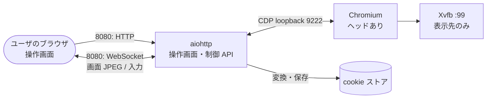
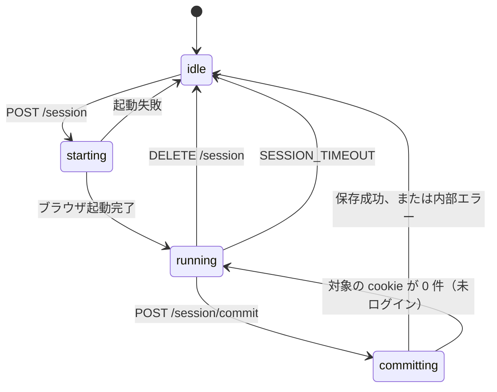

# 設計（browserServer）

全体の構成とアプリ間インターフェース（cookie ストア、プロファイルの定義）は [../design.md](../design.md)。

## cookie セッション認証

| Phase | 内容 |
|---|---|
| Phase 2 | ログイン用ブラウザと cookie の回収・保存（noVNC で操作） |
| Phase 3 | 操作方式を、画面配信（CDP screencast）とタッチ・キー入力の送信へ置き換え。noVNC を廃止 |
| Phase 4 | プロファイルのプリセット・履歴。複数ドメインの cookie 保存 |

### 全体像（Phase 3 以降）

- 常駐するのは aiohttp（操作画面・制御 API・WebSocket）だけ。Xvfb と Chromium は、ログイン操作の開始時に起動し、終了時に止める（B8）。
- 画面は CDP の `Page.startScreencast` で JPEG を受け取り、WebSocket で操作画面へ送る。操作画面は canvas に描く。
- 入力は操作画面から WebSocket で送り、CDP の `Input.*` でページへ届ける。
- LAN に出すのは 8080 だけ。CDP（9222）はコンテナ内の loopback に閉じる（B17）。

### 構成

| 項目 | 内容 |
|---|---|
| ベース | `debian:bookworm-slim`（Chromium の実行に glibc が必要なため、他のアプリの Alpine とは別） |
| パッケージ | `chromium` `xvfb` `fonts-noto-cjk` `python3` `python3-aiohttp`、Python: `tldextract` |
| ポート | 8080（操作画面・制御 API・WebSocket） |
| ボリューム | `./cookies:/cookies`（cookie ストア。api・worker と共有） |
| compose | 3 つの compose ファイルに `browser` サービス（`shm_size: 512m`、`init: true`、`restart: always`）。Tunnel の対象は API のみ |
| 環境変数 | `COOKIE_DIR`（既定 `/cookies`）、`SESSION_TIMEOUT`（秒、既定 900）、`PORT`（既定 8080） |

apiServer / workerServer には、環境変数 `BROWSER_UI_URL`（例 `http://<サーバの IP>:8080`）を設定する。compose では `${BROWSER_UI_URL:-}`（未設定なら `login_url` は `null`）。

### ブラウザの起動（Phase 3）

| 項目 | 内容 |
|---|---|
| 表示 | ヘッドあり（Xvfb 1280x1000 を表示先にするだけで、VNC は使わない） |
| UA | 操作画面がタッチ端末（`pointer: coarse`）なら、起動フラグ `--user-agent` で Android の Chrome を名乗る。PC なら変えない |
| 画面サイズ | CDP `Emulation.setDeviceMetricsOverride` で、操作画面の表示領域（CSS px）と devicePixelRatio（最大 2）に合わせる。タッチ端末なら `mobile: true` と `Emulation.setTouchEmulationEnabled` |
| フラグ | `--no-sandbox` `--disable-dev-shm-usage` `--disable-gpu` `--remote-debugging-port=9222` `--user-data-dir=/tmp/profile-*` `--no-first-run` `--no-default-browser-check` `--lang=ja` `--test-type`（`--no-sandbox` の警告バーを出さない） |

**Turnstile のための制約（検証で確認）:**

| 条件 | Turnstile |
|---|---|
| ヘッドレス（`--headless=new`） | 失敗する |
| CDP `Emulation.setUserAgentOverride` による UA の上書き | 失敗する（Web Worker 内の `navigator.platform` が上書きされず、ページと食い違う） |
| ヘッドあり + 起動フラグ `--user-agent` | 成功する |

このため、ヘッドレスにしない、UA は CDP で上書きしない。

### 画面配信と入力（Phase 3）

WebSocket（`/ws`）のメッセージ。

| 向き | 種類 | 内容 |
|---|---|---|
| サーバ → 画面 | バイナリ | 表示中タブの JPEG（quality 70、表示領域 × dpr） |
| サーバ → 画面 | `url` | 表示中タブの URL |
| サーバ → 画面 | `probe` | 指定座標の要素が入力欄か（`true` / `false` / `"frame"`） |
| 画面 → サーバ | `viewport` | `{width, height, dpr}`。表示領域が変わるたびに送る（キーボードの表示で縮む場合を含む） |
| 画面 → サーバ | `touch` | `{phase: start/move/end/cancel, points: [{id, x, y}]}` → `Input.dispatchTouchEvent`（複数の指に対応） |
| 画面 → サーバ | `mouse` | `{phase: down/move/up, x, y}` → `Input.dispatchMouseEvent`（PC） |
| 画面 → サーバ | `wheel` | `{x, y, dx, dy}` → `mouseWheel` |
| 画面 → サーバ | `probe` | タッチ開始時に座標を送り、入力欄かを問い合わせる |
| 画面 → サーバ | `text` | `Input.insertText` |
| 画面 → サーバ | `key` | `Enter` `Backspace` `Delete` `Tab` `Escape` `ArrowLeft/Right/Up/Down` `Home` `End` → `Input.dispatchKeyEvent` |
| 画面 → サーバ | `nav` | `back`（`history.back()`）、`reload` |

- **キーボード:** 操作画面は、透明なテキスト欄を持つ。タッチ開始時の `probe` で入力欄と分かっていれば、指を離したとき（ユーザ操作の中）にテキスト欄へフォーカスして、端末のキーボードを出す（iOS はユーザ操作の中でしかキーボードを出せない）。入力欄以外なら閉じる。⌨ ボタンでも開閉できる。
- **文字入力:** テキスト欄の内容の差分を送る。日本語入力は確定（`compositionend`）で送る。空の欄では削除キーが届かない端末があるため、番兵の文字を置いて、減った分を `Backspace` として送る。
- **貼り付け:** 「貼付」欄に貼り付けて送る（パスワードマネージャ用）。
- **タブ:** CDP の `Target.setDiscoverTargets` で監視し、開いた元（`openerId`）がある新しいタブ・ポップアップを開いたら、表示をそちらへ切り替える。表示中のタブが閉じたら、残りのタブへ戻る。画面サイズと入力の設定は、タブごとに適用する。
- **フレーム:** 受け取るたびに `Page.screencastFrameAck` を返す。送信が詰まった場合も、最新のフレームだけを送ればよい（古いフレームは捨てる）。

### ログイン操作の状態

- 同時に 1 件。idle 以外での開始は 409（B7）。保存中の取り消しは 409。
- idle に戻るときは、必ず Chromium と Xvfb を終了し、ブラウザのプロファイル（`/tmp/profile-*`）を削除する（B6）。WebSocket も閉じる。
- 保存時に対象の cookie が 0 件のときは、ブラウザを残して `running` に戻す。タイムアウトは、開始時点からの期限のまま。

### 制御 API（LAN 内のみ、認証なし）

| メソッド | パス | 内容 |
|---|---|---|
| GET | `/` | 操作画面。クエリ `profile` `start_url` を反映する（B23） |
| GET | `/profiles` | プリセットと履歴の一覧。`[{name, label, start_url, domains, preset, saved_at}]`（`saved_at` は cookie ファイルの更新時刻、未保存は `null`）。cookie の中身は返さない |
| DELETE | `/profiles/{name}` | 履歴の削除（cookie ファイルも削除）。プリセットは 400、存在しなければ 404 |
| GET | `/session` | `{state, profile, remaining, mobile}` |
| POST | `/session` | `{profile, start_url?, mobile}` でログイン用ブラウザを起動（下記） |
| POST | `/session/commit` | cookie を回収して保存。成功は `{profile, saved, domains}`。実行中でなければ 409。対象の cookie が 0 件なら 422 |
| DELETE | `/session` | 取り消し（何も保存しない） |
| GET | `/ws` | 画面配信と入力（実行中のみ） |

`POST /session` のプロファイルの決め方（Phase 4）:

| 指定 | 動き |
|---|---|
| `profile` がプリセット・履歴にある | 定義の `start_url` と `domains` を使う。`start_url` の指定は無視する |
| `profile` が無く、`start_url` あり | 新しいサイト。`domains` は開始 URL の登録ドメイン。保存に成功したら履歴に追加する |
| `profile` が無く、`start_url` も無い | 400 |

- `profile` は `[A-Za-z0-9_-]{1,64}`、`start_url` は `http(s)` のみ。

### プロファイルの定義（Phase 4）

`src/presets.json`（3 アプリ同一）:

| name | label | start_url | domains |
|---|---|---|---|
| `youtube` | YouTube | `https://accounts.google.com/ServiceLogin?service=youtube&continue=https://www.youtube.com/` | `youtube.com`, `google.com` |
| `niconico` | ニコニコ | `https://account.nicovideo.jp/login` | `nicovideo.jp` |
| `instagram` | Instagram | `https://www.instagram.com/accounts/login/` | `instagram.com` |
| `x` | X (Twitter) | `https://x.com/i/flow/login` | `x.com`, `twitter.com` |
| `bilibili` | Bilibili | `https://passport.bilibili.com/login` | `bilibili.com` |

`COOKIE_DIR/profiles.json`（履歴）: `{"profiles": [{name, label, start_url, domains}]}`。label は name と同じ。書き込みは一時ファイル経由の置き換え、0600。プリセットと同じ名前は追加できない（409）。

- プルダウンの並び: プリセット（定義順）→ 履歴（追加順）→「新しいサイトを追加…」。
- 定義に無い既存の cookie ファイル（Phase 2 で保存したもの）は、プルダウンに出さない。API の `auth_profile` での明示指定では従来どおり使える。

### cookie の回収と保存（commit）

1. CDP の `Storage.getCookies`（ブラウザ全体）で全 cookie を取得する。
2. cookie のドメイン（先頭の `.` を除く）が、プロファイルの `domains` のいずれかと同じか配下のものだけを残す（B5）。新しいサイトの `domains` は、開始 URL のホストの**登録ドメイン**（`tldextract` の同梱リストで判定、外部通信しない）。
3. Netscape 形式へ変換する。

   | 項目 | 規則 |
   |---|---|
   | 行の形式 | `domain \t include_subdomains \t path \t secure \t expires \t name \t value` |
   | HttpOnly | ドメインの前に `#HttpOnly_` を付ける |
   | include_subdomains | ドメインが `.` で始まるとき TRUE |
   | セッション cookie | expires は 0 |

4. `COOKIE_DIR/<profile>.txt` へ、一時ファイル経由で置き換える（0600）。既存のプロファイルは上書きする（再ログイン）。
5. 新しいサイトなら履歴に追加する。
6. Chromium とブラウザのプロファイルを破棄する。YouTube は、保存後にブラウザを閉じることで、yt-dlp の推奨（ログインしたブラウザを閉じ、cookie のローテーションを止める）を満たす。

失効の記録（Redis）は browserServer からは触らない。browserServer は Redis に接続しない。

### 既知の制約

| 制約 | 内容 |
|---|---|
| Turnstile 等の判定 | 判定内容は非公開で変わりうる。画面サイズ・タッチの模擬が将来検出される可能性がある |
| セッション cookie | expires=0 で保存する。yt-dlp が送るかは未検証 |
| cookie の寿命 | サイトが決める。失効は API のログイン要求（401）で分かる |
| ブラウザの環境 | サーバの IP と UA で操作される。別環境での cookie 利用を保護機構が検知する可能性がある |
| ピンチ | 2 本指のタッチは送るが、ページ側がズームに対応するかはサイト次第 |

### 判断の記録

| 判断 | 理由 |
|---|---|
| 画面配信（CDP screencast）と入力の送信を採る。noVNC は廃止（Phase 3） | noVNC はデスクトップ画面の縮小表示とキー入力の都合で、スマートフォンで操作しにくい。画面配信なら、ページ自体がスマートフォン向けに表示され、端末のキーボードを使える |
| 作業者の端末のブラウザでログインさせる方式（リバースプロキシ、拡張機能）は採らない | リバースプロキシは Turnstile・OAuth の戻り先・cookie のドメインが合わず、サイトごとの対応が要る。拡張機能は、アプリの範囲がサーバ側から漏れる |
| ヘッドあり、UA は起動フラグで指定 | Turnstile の検証結果（上記） |
| cookie の回収は Playwright でなく素の CDP | 必要な機能が少なく、依存が軽い |
| 保存は「保存」ボタンの操作で行う。自動検知はしない | サイトごとの設定が要らず、どのサイトでも確実に動く |
| Chromium を毎回起動・破棄する | セッションの取り残しと、別プロファイルへの混入を避ける |
| 操作画面に認証を設けない | LAN 前提（全体要件）。Tunnel の対象外 |
| 履歴は削除のみ（編集なし） | URL を変えたい場合は削除して追加し直せば足りる |
