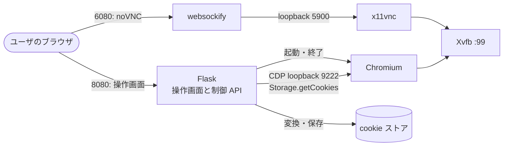
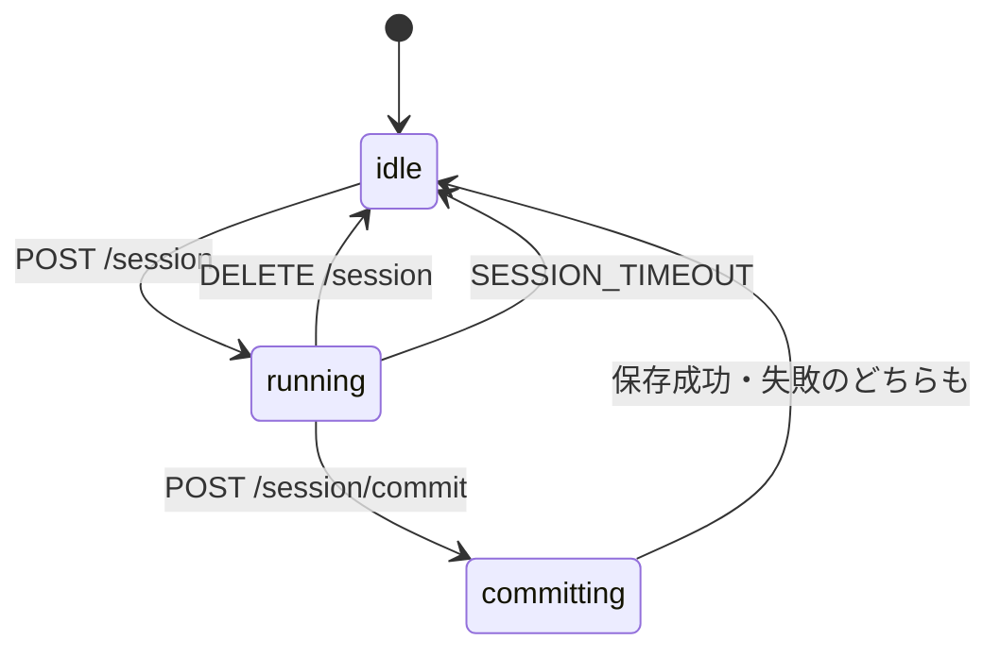

# 設計（browserServer）

全体の構成とアプリ間インターフェース（cookie ストア）は [../design.md](../design.md)。

## cookie セッション認証（Phase 2）

### 全体像

- 常駐するのは Flask（操作画面と制御 API）だけ。Xvfb・x11vnc・websockify・Chromium は、ログイン操作の開始時に起動し、終了時に止める（B8）。
- 操作画面は、ページ内に noVNC を埋め込み（iframe、同じホストの 6080）、同じ画面に「cookie を保存」「キャンセル」を置く。ユーザはこの 1 画面で完結する（B1）。

### 構成

| 項目 | 内容 |
|---|---|
| ベース | `debian:bookworm-slim`（Chromium の実行に glibc が必要なため、他のアプリの Alpine とは別） |
| パッケージ | `chromium` `xvfb` `x11vnc` `novnc` `websockify` `fonts-noto-cjk` `python3`、Python: `flask` `waitress` `websocket-client` `tldextract` |
| ポート | 8080（操作画面・制御 API）、6080（noVNC）。どちらも LAN に公開する |
| loopback のみ | Chromium の CDP（9222）、x11vnc の RFB（5900、`-localhost`）は、コンテナ内に閉じる |
| ボリューム | `./cookies:/cookies`（cookie ストア。api・worker と共有） |
| compose | 3 つの compose ファイルすべてに `browser` サービスを追加（`shm_size: 512m`、`restart: always`）。Tunnel 構成でも、Tunnel の対象は API のみ |
| 環境変数 | `COOKIE_DIR`（既定 `/cookies`）、`SESSION_TIMEOUT`（秒、既定 900）、`PORT`（既定 8080） |

apiServer / workerServer には、環境変数 `BROWSER_UI_URL`（例 `http://<サーバの IP>:8080`）を設定する。

### ログイン操作の状態

- 同時に 1 件。`running` / `committing` 中の開始は 409（B7）。
- idle に戻るときは、必ず Chromium を終了し、ブラウザのプロファイル（`/tmp/profile-<id>`）を削除する（B6）。

### 制御 API（LAN 内のみ、認証なし）

| メソッド | パス | 内容 |
|---|---|---|
| GET | `/` | 操作画面。クエリ `profile` `start_url` を入力欄に反映する（B10） |
| GET | `/session` | `{state, profile, start_url, expires_at}` |
| POST | `/session` | `{profile, start_url}` でログイン用ブラウザを起動。不正な値は 400、実行中は 409 |
| POST | `/session/commit` | cookie を回収して保存。成功は `{profile, saved, domain}`。実行中でなければ 409。対象の cookie が 0 件なら 422（保存しない） |
| DELETE | `/session` | 取り消し（何も保存しない） |

- `profile` は `[A-Za-z0-9_-]{1,64}`、`start_url` は `http(s)` のみ。
- Chromium は `start_url` を開いた状態で起動する。フラグ: `--no-sandbox`（コンテナ内で必要）、`--disable-dev-shm-usage`、`--remote-debugging-port=9222`、`--user-data-dir=/tmp/profile-<id>`、`--window-position=0,0 --window-size=1280,800`、`--no-first-run`、`--lang=ja`。

### cookie の回収と保存（commit）

1. CDP に接続し `Storage.getCookies`（ブラウザ全体）で全 cookie を取得する。接続は `suppress_origin` にする（Origin ヘッダがあると Chromium が 403 で拒否するため）。
2. 開始 URL のホストの**登録ドメイン**（`tldextract` の同梱リストで判定、外部通信しない）を求め、cookie のドメイン（先頭の `.` を除く）が、その登録ドメインと同じか配下のものだけを残す（B5）。
3. Netscape 形式へ変換する。

   | 項目 | 規則 |
   |---|---|
   | 行の形式 | `domain \t include_subdomains \t path \t secure \t expires \t name \t value` |
   | HttpOnly | ドメインの前に `#HttpOnly_` を付ける |
   | include_subdomains | ドメインが `.` で始まるとき TRUE |
   | セッション cookie | expires は 0 |

4. `COOKIE_DIR/<profile>.txt` へ、一時ファイルに書いてから置き換える。権限は 0600。既存のプロファイルは上書きする（再ログインによる更新）。
5. Chromium とブラウザのプロファイルを破棄する。

失効の記録（Redis）は browserServer からは触らない。ファイルが新しくなることで、`expired` は自動で `valid` に戻る（[../design.md](../design.md) のプロファイルの状態）。browserServer は Redis に接続しない。

### 共通処理

`cookies.py`（プロファイル名の検証、`cookie_path`）を、apiServer・workerServer と同一内容で置く。cookie の一時ファイル経由の置き換え書き込みは、共通処理 `save_profile()` として `cookies.py` に追加し、3 アプリで同一に保つ（一致はテストで確認する）。

### 既知の制約

| 制約 | 内容 |
|---|---|
| 複数ドメインのサイト | 開始 URL の登録ドメインのみ保存する。Google と YouTube のように、別ドメインの cookie が必要なサイトは、Phase 3 で扱う |
| セッション cookie | expires=0 で保存する。yt-dlp が送るかは、実装後の検証項目 |
| cookie の寿命 | サイトが決める。失効は API のログイン要求（401）で分かる |
| ブラウザの環境 | サーバの IP と UA で操作される。サイトによっては、別環境での cookie 利用を保護機構が検知する可能性がある |

### 判断の記録

| 判断 | 理由 |
|---|---|
| ブラウザ内リモートデスクトップ（noVNC）を採る。xrdp や MITM プロキシは採らない | クライアントソフトが要らず、実 Chromium なので CAPTCHA・2 段階認証を人が通せる。MITM は CA 導入・HSTS・ログイン拒否の問題がある |
| cookie の回収は Playwright でなく素の CDP | 必要なのは `Storage.getCookies` だけで、依存が軽い |
| 保存は「保存」ボタンの操作で行う。自動検知はしない | サイトごとの設定が要らず、どのサイトでも確実に動く |
| Chromium を毎回起動・破棄する | セッションの取り残しと、別プロファイルへの混入を避ける |
| 操作画面に認証を設けない | LAN 前提（全体要件）。Tunnel の対象外であることで、外部からは到達させない |
