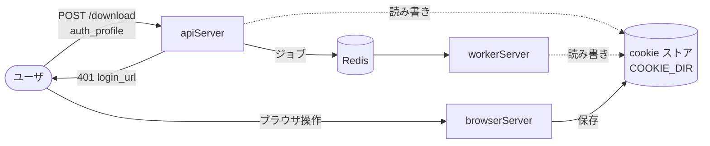

# 設計（全体）

実装の詳細は各アプリの `design.md` を一次情報とする。ここには役割分担とアプリ間のインターフェースだけを書く。

- [apiServer/design.md](apiServer/design.md)
- [workerServer/design.md](workerServer/design.md)
- [browserServer/design.md](browserServer/design.md)

## cookie セッション認証

### 構成

| アプリ | 役割 | 状態 |
|---|---|---|
| apiServer | probe 時に cookie を使う。ログイン要求を 401 で返す | 実装済み（Phase 1） |
| workerServer | 実行時に cookie を使う。失効を記録し、リトライ対象から外す | 実装済み（Phase 1） |
| browserServer | ユーザがログインするブラウザを提供し、cookie を回収して保存する | 実装済み（Phase 2） |

### アプリ間インターフェース: cookie ストア

3 つのアプリが共有するディレクトリ。ファイルとその意味が、アプリ間の契約になる。

| 項目 | 内容 |
|---|---|
| 場所 | 環境変数 `COOKIE_DIR`（既定 `/cookies`）。Docker Compose ではホストの `./cookies` |
| ファイル | `<プロファイル名>.txt`（Netscape 形式）。プロファイル名は `[A-Za-z0-9_-]{1,64}` |
| 権限 | 0600 |
| 書き込み | 更新は一時ファイルへ書いてから置き換える（読み手に途中状態を見せない） |
| 書き手 | browserServer（ログイン時の新規・更新）、apiServer / workerServer（yt-dlp が更新した cookie の書き戻し） |

### プロファイルの状態

| 状態 | 条件 |
|---|---|
| `missing` | ファイルが無い |
| `valid` | ファイルがあり、失効の記録が無い、または失効記録より新しいファイルに置き換わっている |
| `expired` | ログイン要求を検知した記録（Redis `ytdlp:auth:profile:<name>` の `expired_at`）以降、ファイルが更新されていない |

失効の記録は Redis に持ち、ファイルが新しくなれば自動で `valid` に戻る（R6）。

### 判断の記録

| 判断 | 理由 |
|---|---|
| ID/パスワードの自動ログインを採らず、人がブラウザでログインする | ニコニコは Cloudflare Turnstile があり自動化できない。Google も自動ログインが不安定。サイトごとの実装も要らなくなる（R3, R9） |
| cookie の登録・ログイン操作を API に置かない | Tunnel で外部に出る API に、セッションの入口を作らないため（R7） |
| 共有はファイルで行い、Redis に cookie を入れない | Redis は Redis Insight から見えるため（R8） |
| yt-dlp には一時コピーを渡し、更新分だけ書き戻す | yt-dlp は cookie ファイルを書き換える。並列ジョブで途中状態を読ませないため |
| `cookies.py` は 3 アプリに同一内容で置く | 既存の `with_youtube_defaults` と同じ運用。同一性はテストで確認する |
