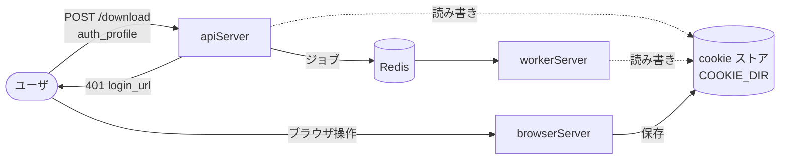
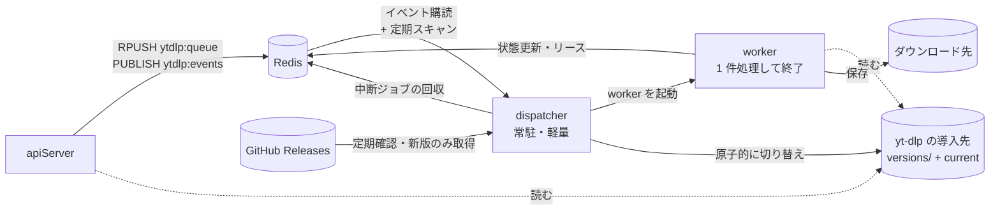
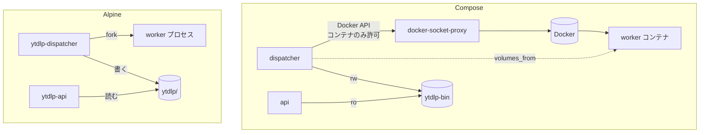

# 設計（全体）

実装の詳細は各アプリの `design.md` を一次情報とする。ここには役割分担とアプリ間のインターフェースだけを書く。

- [apiServer/design.md](apiServer/design.md)
- [workerServer/design.md](workerServer/design.md)（dispatcher を含む）
- [browserServer/design.md](browserServer/design.md)

## cookie セッション認証

### 構成


```mermaid
flowchart LR
    U([ユーザ]) -->|POST /download<br>auth_profile| API[apiServer]
    U -->|ブラウザ操作| BR[browserServer]
    API -->|ジョブ| R[(Redis)]
    R --> W[workerServer]
    API -.->|読み書き| C[(cookie ストア<br>COOKIE_DIR)]
    W -.->|読み書き| C
    BR -->|保存| C
    API -->|401 login_url| U
```

| アプリ | 役割 | 状態 |
|---|---|---|
| apiServer | probe 時に cookie を使う。ログイン要求を 401 で返す | 実装済み（Phase 1） |
| workerServer | 実行時に cookie を使う。失効を記録し、リトライ対象から外す | 実装済み（Phase 1） |
| browserServer | ユーザがログインするブラウザを提供し、cookie を回収して保存する | 実装済み（Phase 2・3・4） |

### アプリ間インターフェース: cookie ストア

3 つのアプリが共有するディレクトリ。ファイルとその意味が、アプリ間の契約になる。

| 項目 | 内容 |
|---|---|
| 場所 | 環境変数 `COOKIE_DIR`（既定 `/cookies`）。Docker Compose ではホストの `./cookies` |
| ファイル | `<プロファイル名>.txt`（Netscape 形式）。プロファイル名は `[A-Za-z0-9_-]{1,64}` |
| 権限 | 0600 |
| 書き込み | 更新は一時ファイルへ書いてから置き換える（読み手に途中状態を見せない） |
| 書き手 | browserServer（ログイン時の新規・更新）、apiServer / workerServer（yt-dlp が更新した cookie の書き戻し） |

### アプリ間インターフェース: プロファイルの定義（Phase 4）

プロファイルは「名前・表示名・開始 URL・対象ドメイン」の組。3 アプリが同じ定義を読む。

| 種類 | 置き場所 | 書き手 |
|---|---|---|
| プリセット | 各アプリの `src/presets.json`（3 アプリで同一内容。一致はテストで確認する） | 開発者（リポジトリ） |
| 履歴 | `COOKIE_DIR/profiles.json`（cookie ストア内、0600） | browserServer（ユーザが新しいサイトで保存したとき追加、削除操作で削除） |

- 対象ドメインは、保存する cookie の絞り込み（browserServer）と、URL からのプロファイルの自動選択（apiServer・workerServer）の両方に使う。
- URL のホストが、対象ドメインと同じか、その配下なら一致とする。プリセットを先に、次に履歴を見る。
- 定義を読む処理は `cookies.py` に置く（3 アプリ同一）。

### プロファイルの状態

| 状態 | 条件 |
|---|---|
| `missing` | ファイルが無い |
| `valid` | ファイルがあり、失効の記録が無い、または失効記録より新しいファイルに置き換わっている |
| `expired` | ログイン要求を検知した記録（Redis `ytdlp:auth:profile:<name>` の `expired_at`）以降、ファイルが更新されていない |

失効の記録は Redis に持ち、ファイルが新しくなれば自動で `valid` に戻る（R6）。

### 判断の記録

| 判断 | 理由 |
|---|---|
| ID/パスワードの自動ログインを採らず、人がブラウザでログインする | ニコニコは Cloudflare Turnstile があり自動化できない。Google も自動ログインが不安定。サイトごとの実装も要らなくなる（R3, R9） |
| cookie の登録・ログイン操作を API に置かない | Tunnel で外部に出る API に、セッションの入口を作らないため（R7） |
| 共有はファイルで行い、Redis に cookie を入れない | Redis は Redis Insight から見えるため（R8） |
| yt-dlp には一時コピーを渡し、更新分だけ書き戻す | yt-dlp は cookie ファイルを書き換える。並列ジョブで途中状態を読ませないため |
| `cookies.py` は 3 アプリに同一内容で置く | 既存の `with_youtube_defaults` と同じ運用。同一性はテストで確認する |
| プロファイルをサイト単位とし、URL から自動で選ぶ（Phase 4） | アカウントの使い分けの要件が無い。既存の呼び出し（iOS ショートカット等）を変えずに cookie を使えるようにするため |
| プリセットは `presets.json`（リポジトリ同梱）、ユーザの追加分は cookie ストア内の `profiles.json` に分ける | プリセットの更新（リポジトリ）と、ユーザのデータ（ボリューム）を混ぜないため |

## イベント駆動の worker 起動と yt-dlp の更新方式

### 構成

worker は常駐しない。軽量な dispatcher が Redis を見張り、処理対象のジョブがあるときだけ worker を起動する。
dispatcher は、yt-dlp の新版の確認と適用、中断されたジョブの回収も担う。
dispatcher と worker は同じイメージ（`workerServer`）で、起動するコマンドだけが違う。


```mermaid
flowchart LR
    API[apiServer] -->|RPUSH ytdlp:queue<br>PUBLISH ytdlp:events| R[(Redis)]
    R -->|イベント購読<br>+ 定期スキャン| D[dispatcher<br>常駐・軽量]
    D -->|worker を起動| W[worker<br>1 件処理して終了]
    W -->|状態更新・リース| R
    D -->|中断ジョブの回収| R
    GH[(GitHub Releases)] -->|定期確認・新版のみ取得| D
    D -->|原子的に切り替え| Y[(yt-dlp の導入先<br>versions/ + current)]
    API -.->|読む| Y
    W -.->|読む| Y
    W -->|保存| S[(ダウンロード先)]
```

| 役割 | 常駐 | 外部への通信 | 内容 |
|---|---|---|---|
| dispatcher | する | GitHub（新版の確認。新版があるときだけ取得） | 起動判断、yt-dlp の更新、worker の起動・数の管理、中断ジョブの回収 |
| worker | しない | 動画サイトのみ | 従来の worker。yt-dlp の更新はしない |
| apiServer | する | 動画サイトのみ（probe） | yt-dlp を更新しない。再起動もしない |

### 起動手段

| 環境 | dispatcher | worker の起動 | yt-dlp の導入先の共有 |
|---|---|---|---|
| Docker Compose | `dispatcher` サービス（常駐コンテナ） | docker-socket-proxy 経由で、同じイメージのコンテナを作成・起動（終了時に自動削除） | 名前付きボリューム `ytdlp-bin`。dispatcher が書き、api（読み取り専用）と worker が読む |
| Alpine | OpenRC サービス `ytdlp-dispatcher`（1 つ） | dispatcher の子プロセス | `$INSTALL_DIR/ytdlp`。dispatcher が書き、api・worker が読む |


```mermaid
flowchart TD
    subgraph Compose
      D1[dispatcher] -->|Docker API<br>コンテナのみ許可| P[docker-socket-proxy] --> DK[(Docker)]
      DK --> W1[worker コンテナ]
      D1 -.->|volumes_from| W1
      D1 -->|rw| V[(ytdlp-bin)]
      A1[api] -->|ro| V
    end
    subgraph Alpine
      D2[ytdlp-dispatcher] -->|fork| W2[worker プロセス]
      D2 -->|書く| V2[(ytdlp/)]
      A2[ytdlp-api] -->|読む| V2
    end
```

### yt-dlp の配布方式

apiServer・worker とも yt-dlp を `subprocess` で呼ぶため、実体を差し替えれば、再起動なしに反映できる。
差し替えの方式を、検証サーバ（Alpine 3.21 のコンテナ、yt-dlp 2026.08.19）で比較した。

| 観点 | 現状（再起動 + `pip install --upgrade`） | pip を版ごとの場所へ導入して切替 | GitHub Releases の単一バイナリ（採用） |
|---|---|---|---|
| 再起動 | 必要 | 不要 | 不要 |
| 新版の確認 | 毎回 `pip` が pypi.org へ問い合わせ | pypi.org の JSON 1.2MB（または `pip`） | `github.com/.../releases/latest` の HEAD。約 0.3 秒、本文なし |
| 取得量・時間 | 約 4.5 秒（依存解決を含む） | 約 4.5 秒・導入先 84.5MB / 版 | 40.5MB・約 1.3 秒 / 版 |
| 外部の名前 | pypi.org、files.pythonhosted.org | 同左 | 確認: github.com のみ。取得時のみ release-assets.githubusercontent.com |
| 原子的な切替 | できない（上書き） | シンボリックリンクの切替で可能 | 同左（実行中のダウンロードが切替をまたいで完走することを確認） |
| 取得物の検証 | なし | なし | `SHA2-256SUMS` と一致（確認済み）。破損は実行時に検出できる |
| 依存（curl-cffi・EJS・mutagen 等）との整合 | pip が解決 | pip が解決 | 同梱（整合済み。実行環境の Python に依存しない） |
| 起動時間（`--version`） | 0.21 秒 | 0.21 秒 | 0.59 秒（+0.38 秒。展開のため） |
| 実行時のディスク | — | — | 実行ごとに `/tmp` へ約 80MB 展開し、終了時に削除 |
| YouTube の probe 成功率（2 動画 × 各 8 回、pip 版と交互） | — | 16/16 | 16/16 |
| 実ダウンロード（ffmpeg でマージ） | — | — | 成功（webm 9.1MB、3.3 秒） |

- 上記のほか、musl 向けの正式な配布物がある（`yt-dlp_musllinux`、`yt-dlp_musllinux_aarch64`）。curl-cffi（impersonate）・EJS・node の検出、bgutil プラグイン（後述）が動くことを確認した。
- 起動の +0.38 秒は、probe（約 2〜3 秒）の 15% 程度で、ダウンロードには影響しない。実行ごとの `/tmp` の約 80MB は、既知の制約とする（[workerServer/design.md](workerServer/design.md)）。
- `yt-dlp -U`（自己更新）も動作した（旧版 → 最新、約 1.9 秒）が、採用しない。導入先を版ごとに分けられず、切替・ロールバック・複数コンテナからの共有を制御できないため。
- zipapp 版（`yt-dlp`、3MB）は、起動が 0.58 秒で、依存を別に導入する必要があるため、採用しない。

#### 導入先の構成

```
<導入先>/
  versions/<版>/yt-dlp     … 取得した版（既定で直近 2 版を残す）
  current -> versions/<版>  … 使う版（シンボリックリンク。原子的に切り替える）
```

- apiServer・worker は `PATH` の先頭に `<導入先>/current` を置いて `yt-dlp` を呼ぶ。
- イメージには、ビルド時に取得した版を別の場所（`/opt/ytdlp-image`）に同梱し、`PATH` の後ろに置く。導入先が空・壊れているときのフォールバックになる。
- bgutil プラグインは、yt-dlp のバイナリでは `PYTHONPATH` 経由で読まれないため、`/etc/yt-dlp/plugins/bgutil/`（標準の置き場）へ `pip install --no-deps --target` で導入する。プラグインは yt-dlp の更新の対象外（従来と同じくイメージ・インストール時に固定される）。

### 判断の記録

| 判断 | 理由 |
|---|---|
| API が worker を直接起動せず、dispatcher を置く | 外部に公開される API へコンテナ操作の権限を渡さないため（E8）。自動リトライの契機も 1 か所（dispatcher）で扱える（E7） |
| 通知（Redis Pub/Sub）と定期スキャンを併用する | Pub/Sub は取りこぼしうる（購読前・再接続中の発行は届かない）。通知で即時性（E2）を、定期スキャンで確実性を得る。Redis の設定変更（キースペース通知）は要らない |
| yt-dlp の更新を、ジョブの有無に関わらず、dispatcher が定期的に確認して一括で行う | 更新の責務を 1 か所にして、api と worker が同じ版を使う（E10）。確認は HEAD 1 回で軽く、ジョブが無い間の通信を「6 時間に 1 回」に抑えられる（E3）。ジョブ投入時に更新を待たせない |
| yt-dlp を pip ではなく GitHub のバイナリで配る | 確認が軽量・取得が単純・依存が同梱で、原子的な切替ができる。pip 版と機能・成功率が同等であることを確認した（上記の比較）。起動時間と `/tmp` の増加は許容できる |
| apiServer の再起動を廃止する | 再起動は、yt-dlp の更新のためだけに行っていた（E13）。実体の差し替えで足りる |
| probe の失敗時は、再起動ではなく、新版の確認を依頼する | 失敗が yt-dlp の陳腐化によるかもしれない（従来の再起動の目的）。クールダウンで確認の頻度を抑える（E12） |
| Compose では、worker のマウント・ネットワーク・環境変数を dispatcher のコンテナから引き継ぐ（`volumes_from`） | worker を起動するためにホスト側のパスを設定へ持たせずに済み、dispatcher の権限で任意のマウントを作らせない（E8） |
| dispatcher はジョブの内容を読まず、件数と状態だけを見る | ジョブの内容（URL・オプション）で dispatcher が影響を受けないため（E8） |
| worker はキューが空なら待たず（`LPOP` 系）すぐ終了する | 起動判断とのずれで空振りしても、すぐ消えて害が無い。待機中の worker を作らない（E1） |
| ジョブの取得と状態遷移を Redis の原子操作にし、生存はリース（TTL 付きキー）で判定する | 取り出し後・遷移中の停止でも失われず（E14）、同時実行を防ぎ（E16）、異常終了した worker のジョブを回収できる（E15）。詳細は [workerServer/design.md](workerServer/design.md) |

詳細（起動数の決め方、更新の手順、ライフサイクル、設定、移行）は [workerServer/design.md](workerServer/design.md)。
API が通知を発行する点と、再起動の廃止は [apiServer/design.md](apiServer/design.md)。
