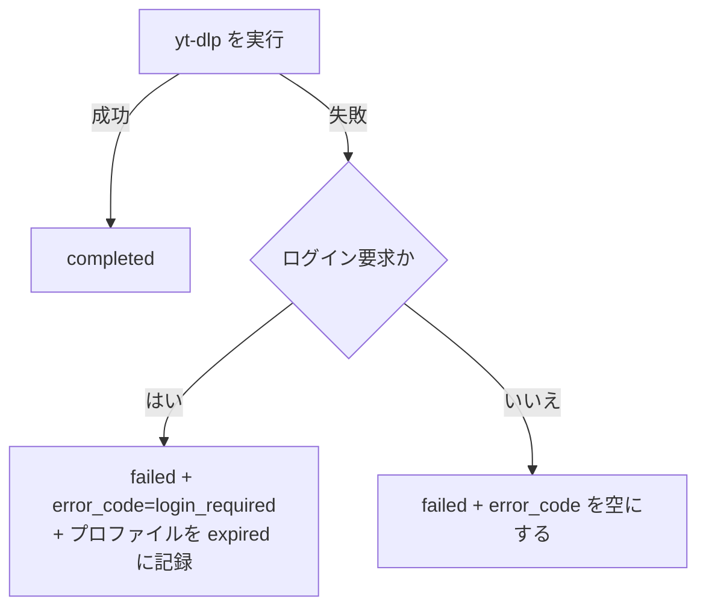

# 設計（workerServer）

全体の構成とアプリ間インターフェース（cookie ストア、プロファイルの状態）は [../design.md](../design.md)。

## cookie セッション認証

### Phase 1: cookie の利用と失効の記録（実装済み）

#### 実行

- ジョブの `auth_profile` があれば、cookie の一時コピーを `--cookies` に渡して yt-dlp を実行する。終了時、内容が変わっていれば書き戻す（失敗した場合も）。
- 指定プロファイルの cookie が無い場合は、実行せずに、ログイン要求として失敗させる。
- ログに出すコマンドは `--cookies` の値を `<cookies>` に置き換える。

#### 失敗の記録

| Redis のジョブ hash | 内容 |
|---|---|
| `auth_profile` | プロファイル名（未指定は空） |
| `error_code` | ログイン要求で失敗したとき `login_required`。それ以外の失敗では空（前回の値を残さない） |
| `login_url` | `BROWSER_UI_URL` があるとき再ログイン先。無ければ空 |

#### 自動リトライの除外

`find_retryable_failed_key` は、次のジョブを対象から外す。

| ジョブ | 扱い |
|---|---|
| `error_code=login_required`、プロファイル未指定 | 常に対象外（再試行しても解決しない） |
| `error_code=login_required`、プロファイルが `valid` 以外 | 対象外。cookie が更新されて `valid` に戻れば対象に戻る |
| それ以外 | 従来どおり（`failed_count < RETRY_COUNT`） |

### Phase 2: 再ログイン用画面への誘導

- `login_url` は、apiServer と同じ組み立て（`cookies.login_url(profile, url)`）で、ジョブの URL の origin を `start_url` に使う。

### Phase 4: 再ログイン用 URL のプロファイル

- ジョブに `auth_profile` が無いとき、`cookies.resolve_profile(url)` で対応するプロファイルを求め、`login_url` の `profile` に使う。
- 自動リトライの除外（Phase 1）は、ジョブの `auth_profile` で判定する。自動選択されたプロファイルは API がジョブに入れるため、同じ扱いになる。
