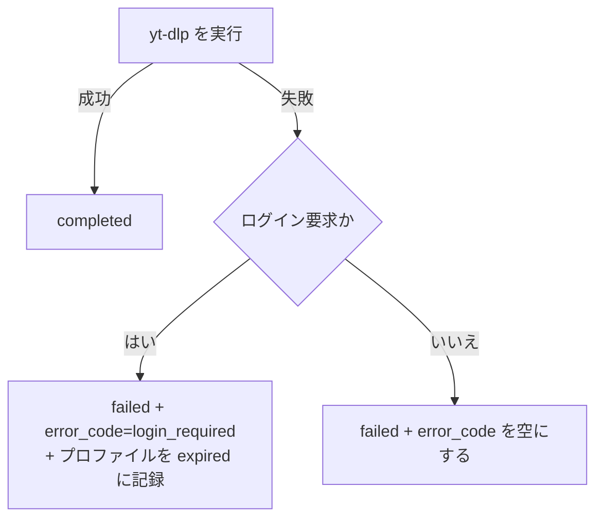
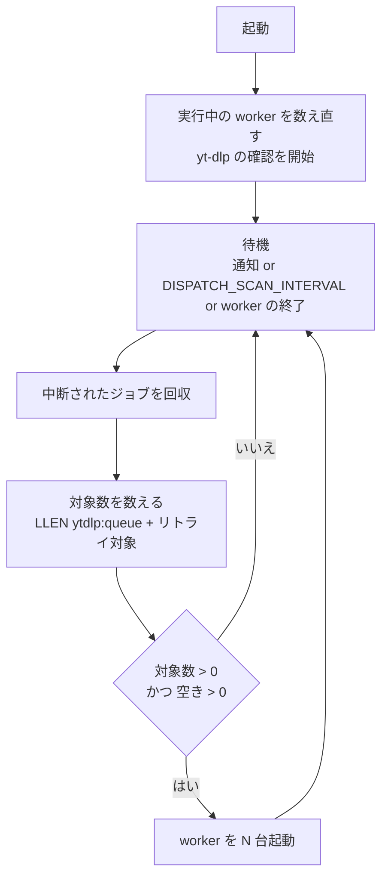
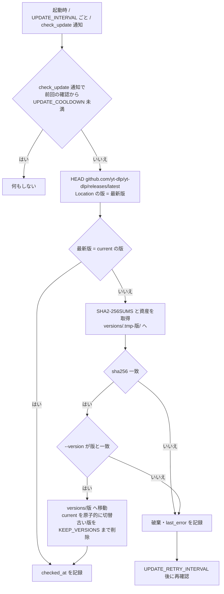
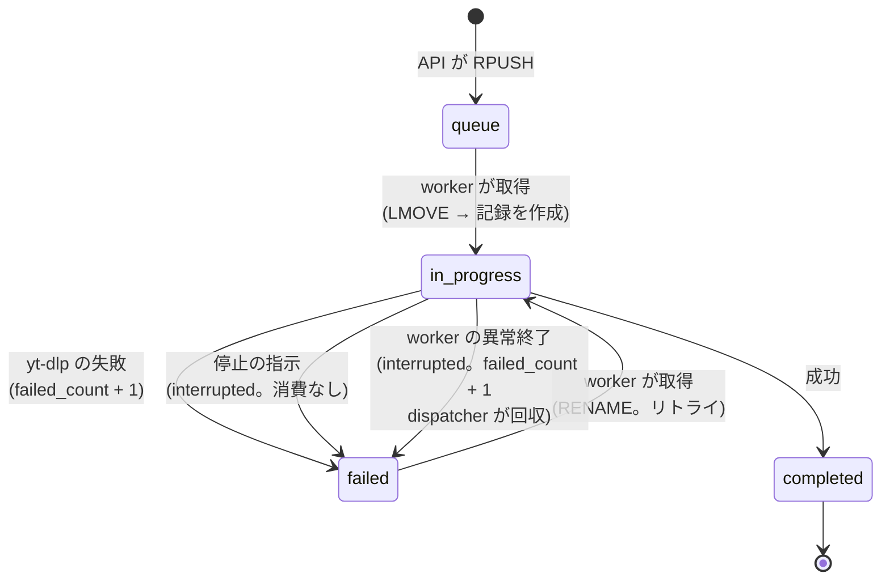

# 設計（workerServer）

全体の構成とアプリ間インターフェース（cookie ストア、プロファイルの状態）は [../design.md](../design.md)。

## cookie セッション認証

### Phase 1: cookie の利用と失効の記録（実装済み）

#### 実行

- ジョブの `auth_profile` があれば、cookie の一時コピーを `--cookies` に渡して yt-dlp を実行する。終了時、内容が変わっていれば書き戻す（失敗した場合も）。
- 指定プロファイルの cookie が無い場合は、実行せずに、ログイン要求として失敗させる。
- ログに出すコマンドは `--cookies` の値を `<cookies>` に置き換える。

#### 失敗の記録

```mermaid
flowchart TD
    R[yt-dlp を実行] -->|成功| OK[completed]
    R -->|失敗| C{ログイン要求か}
    C -- はい --> L["failed + error_code=login_required<br>+ プロファイルを expired に記録"]
    C -- いいえ --> N["failed + error_code を空にする"]
```

| Redis のジョブ hash | 内容 |
|---|---|
| `auth_profile` | プロファイル名（未指定は空） |
| `error_code` | ログイン要求で失敗したとき `login_required`。それ以外の失敗では空（前回の値を残さない） |
| `login_url` | `BROWSER_UI_URL` があるとき再ログイン先。無ければ空 |

#### 自動リトライの除外

`find_retryable_failed_key` は、次のジョブを対象から外す。

| ジョブ | 扱い |
|---|---|
| `error_code=login_required`、プロファイル未指定 | 常に対象外（再試行しても解決しない） |
| `error_code=login_required`、プロファイルが `valid` 以外 | 対象外。cookie が更新されて `valid` に戻れば対象に戻る |
| それ以外 | 従来どおり（`failed_count < RETRY_COUNT`） |

### Phase 2: 再ログイン用画面への誘導

- `login_url` は、apiServer と同じ組み立て（`cookies.login_url(profile, url)`）で、ジョブの URL の origin を `start_url` に使う。

### Phase 4: 再ログイン用 URL のプロファイル

- ジョブに `auth_profile` が無いとき、`cookies.resolve_profile(url)` で対応するプロファイルを求め、`login_url` の `profile` に使う。
- 自動リトライの除外（Phase 1）は、ジョブの `auth_profile` で判定する。自動選択されたプロファイルは API がジョブに入れるため、同じ扱いになる。

## イベント駆動の worker 起動、yt-dlp の更新、ライフサイクル

全体の構成・起動手段・yt-dlp の配布方式の比較・判断の記録は [../design.md](../design.md)。ここでは実装仕様を定める。

### コンポーネント

| ファイル | 内容 |
|---|---|
| `src/dispatcher.py`（新規） | dispatcher 本体。監視ループ、worker の起動・数の管理、回収の呼び出し |
| `src/updater.py`（新規） | yt-dlp の新版の確認・取得・検証・切替。dispatcher の別スレッドで動く |
| `src/jobs.py`（新規） | ジョブの状態遷移・取得・回収・リース。worker と dispatcher が共有する（既存の `find_retryable_failed_key`・`is_waiting_for_login` もここへ移す） |
| `src/main.py` | worker。取得・ハートビート・停止処理を `jobs.py` の上に組み直す |
| `src/function.py` | `run_yt_dlp` を `subprocess.run` から `Popen` に変え、停止の指示を子プロセスへ伝えられるようにする |
| `entrypoint.sh` | worker の entrypoint から `pip install --upgrade` を除去する。dispatcher のコマンドは `dispatcher.py` |

### dispatcher の動作

```mermaid
flowchart TD
    S[起動] --> A[実行中の worker を数え直す<br>yt-dlp の確認を開始]
    A --> L[待機<br>通知 or DISPATCH_SCAN_INTERVAL or worker の終了]
    L --> RC[中断されたジョブを回収]
    RC --> E[対象数を数える<br>LLEN ytdlp:queue + リトライ対象]
    E --> Q{対象数 > 0<br>かつ 空き > 0}
    Q -- いいえ --> L
    Q -- はい --> W[worker を N 台起動]
    W --> L
```

| 項目 | 内容 |
|---|---|
| 通知 | Redis のチャンネル `ytdlp:events` を購読する。メッセージは種別を表す: `queued`（ジョブの投入・再実行の指示）、`check_update`（yt-dlp の確認の依頼）。切断されたら再接続する |
| 定期スキャン | 通知が無くても `DISPATCH_SCAN_INTERVAL`（既定 30 秒）ごとに再評価する。cookie の更新でリトライ対象が復帰するケースはこれで拾う |
| 対象数 | `LLEN ytdlp:queue` + `ytdlp:jobs:failed:*` のうち `failed_count < RETRY_COUNT` かつログイン待ちでないもの（判定は既存の `is_waiting_for_login` と共通） |
| 起動数 | `min(対象数, WORKER_MAX − 実行中の worker 数)`。実行中の数（`running_count()`）は、採用した起動先（`backends.py`）がいずれも起動と同時に同期的に反映するため、起動猶予（別途のカウント）は設けていない |
| 空振り | 判断と worker の取得のずれで、起動した worker がジョブを取れなかった場合は、worker がすぐ終了する。害は無い |
| ジョブの内容 | `LLEN` と、リトライ判定・回収に要る hash のフィールド（`failed_count`・`error_code`・`auth_profile`・`worker_id`・`started_at`）しか読まない（E8） |

#### 起動失敗・異常終了のバックオフ（W15）

ジョブを処理せずに終了コード 0 以外で終わった worker（Redis に接続できないなど）が続くと、起動を繰り返してしまう。
連続した異常終了の回数に応じて、次の起動までの間隔を 5 秒から倍にして最大 60 秒まで空ける。正常に終了した worker があれば元に戻す。

### yt-dlp の更新

導入先の構成と、方式の比較は [../design.md](../design.md)。

```mermaid
flowchart TD
    T[起動時 / UPDATE_INTERVAL ごと / check_update 通知] --> C{check_update 通知で<br>前回の確認から<br>UPDATE_COOLDOWN 未満}
    C -- はい --> X[何もしない]
    C -- いいえ --> H["HEAD github.com/yt-dlp/yt-dlp/releases/latest<br>Location の版 = 最新版"]
    H --> V{最新版 = current の版}
    V -- はい --> R[checked_at を記録]
    V -- いいえ --> D["SHA2-256SUMS と資産を取得<br>versions/.tmp-版/ へ"]
    D --> K{sha256 一致}
    K -- いいえ --> F[破棄・last_error を記録]
    K -- はい --> E{"--version が版と一致"}
    E -- いいえ --> F
    E -- はい --> M["versions/版 へ移動<br>current を原子的に切替<br>古い版を KEEP_VERSIONS まで削除"]
    M --> R
    F --> RT[UPDATE_RETRY_INTERVAL 後に再確認]
```

| 項目 | 内容 |
|---|---|
| 取得元 | `https://github.com/yt-dlp/yt-dlp/releases/latest`（環境変数 `YTDLP_REPO` で変更できる）。API（`api.github.com`）は使わない（未認証は 60 回 / 時の制限があるため） |
| 資産 | `uname -m` で選ぶ: `x86_64` は `yt-dlp_musllinux`、`aarch64` は `yt-dlp_musllinux_aarch64`。チェックサムは同じ版の `SHA2-256SUMS` |
| 切替 | `ln -sfn versions/<版> current.tmp` → `mv -T current.tmp current`（`rename`。原子的）。実行中のプロセスは旧版のまま完走し、新規に起動するものが新版になる（検証済み） |
| 実行中のファイル | 旧版のファイルは、切替後も削除しない（`KEEP_VERSIONS` の範囲）。新しいファイルへの切替のみで、実行中のバイナリへは書き込まない |
| 記録（Redis hash `ytdlp:updater`） | `checked_at`（前回の確認）、`current`（導入中の版）、`updated_at`、`last_error` |
| 実行 | 別スレッドで行い、取得中も worker の起動を止めない。同時に 1 つだけ実行する |
| 失敗時 | `last_error` を記録し、ログに `WARNING` を出す。導入済みの版のまま。`UPDATE_RETRY_INTERVAL`（既定 30 分）後に再確認する |
| 確認の間隔 | `UPDATE_INTERVAL`（既定 21600 秒）。`check_update` 通知は、前回の確認から `UPDATE_COOLDOWN`（既定 1800 秒）が経過していれば、確認を前倒しする |
| 通信先 | 確認: `github.com`。取得時のみ `release-assets.githubusercontent.com`（リダイレクト先） |

### worker のライフサイクル

#### 状態の遷移

```mermaid
stateDiagram-v2
    [*] --> queue: API が RPUSH
    queue --> in_progress: worker が取得<br>(LMOVE → 記録を作成)
    failed --> in_progress: worker が取得<br>(RENAME。リトライ)
    in_progress --> completed: 成功
    in_progress --> failed: yt-dlp の失敗<br>(failed_count + 1)
    in_progress --> failed: 停止の指示<br>(interrupted。消費なし)
    in_progress --> failed: worker の異常終了<br>(interrupted。failed_count + 1<br>dispatcher が回収)
    completed --> [*]
```

- 従来の `pending`（取得直後の一瞬だけ存在した中間状態）は使わず、取得と同時に `in_progress` で記録を作る。`pending` の記録が残ることはなくなる。
- 状態は、従来どおりキー名（`ytdlp:jobs:<status>:<id>`）に持つ。

#### Redis の記録

| キー | 型 | 内容 |
|---|---|---|
| `ytdlp:queue` | list | 従来どおり。API が `RPUSH` する |
| `ytdlp:processing:<worker_id>` | list | 取り出したが、`in_progress` の記録をまだ作っていないジョブの JSON（最大 1 要素） |
| `ytdlp:queue:dead` | list | 解析できないジョブの JSON（調査用に退避。回収の対象外） |
| `ytdlp:workers:<worker_id>` | string（TTL `LEASE_TTL`） | リース。存在する間、その worker は生きているとみなす |
| `ytdlp:jobs:<status>:<id>` | hash | 従来の項目に加え、`worker_id`（実行中の worker）、`error_code=interrupted` |

`worker_id` は、起動ごとの一意な値（ホスト名・プロセス ID・起動時刻）。

#### 取得（worker の起動時）

1. リースを作り（`SET ytdlp:workers:<id> 1 EX LEASE_TTL`）、ハートビートのスレッド（`HEARTBEAT_INTERVAL` ごとに更新）を始める。
2. リトライ対象を探し、`RENAMENX ytdlp:jobs:failed:<id> ytdlp:jobs:in_progress:<id>` で取得する。成功した worker だけがそのジョブの所有者になる。失敗（他の worker が先に取得した）なら、次の候補へ。
3. リトライ対象が無ければ、`LMOVE ytdlp:queue ytdlp:processing:<worker_id> LEFT RIGHT` で 1 件を移す。空なら終了する（待たない）。
4. ジョブの JSON を解析する。解析できなければ `ytdlp:queue:dead` へ移して終了する。
5. `ytdlp:jobs:in_progress:<job id>` を、`worker_id`・`started_at` を含めて作る。続けて `ytdlp:processing:<worker_id>` を削除する。
6. yt-dlp を実行する。

- 手順 3 と 5 の間に停止しても、ジョブは `processing` のリストに残るため、失われない（E14）。手順 5 の作成と削除の間に停止しても、回収時に「記録があるので、リストの要素だけを消す」で二重に実行しない。
- `LMOVE` は Redis 6.2 以降（Alpine 3.21 の `redis` は 7.2、Compose の `redis` イメージは 8.x で確認）。
- 状態の遷移は `RENAME`（原子的）の後に `HSET` で項目を更新する。

#### 完了・失敗の記録

- 記録の前に、`ytdlp:jobs:in_progress:<id>` の `worker_id` が自分であることを確認する。異なる（回収されて別の worker が所有した）ときは、書き込まずに終了する（W25）。
- 成功は `completed`、yt-dlp の失敗は `failed`（`failed_count + 1`）。ログインの要求による失敗の扱いは従来どおり（Phase 1）。
- 終了時に、リースを削除する。

#### 停止の指示（W24）

1. SIGTERM・SIGINT で、停止のフラグを立て、yt-dlp の子プロセスへ SIGTERM を送り、`STOP_GRACE`（20 秒）待つ。終わらなければ SIGKILL。
2. ジョブを `failed` へ `RENAME` し、`error_code=interrupted`、`error`（停止による中断）、`failed_count` は**変えない**。
3. リースを削除して、終了コード 0 で終了する。

Compose の worker コンテナは、`StopTimeout=30` で作成する（停止の指示から SIGKILL までの猶予）。

#### 異常終了の回収（W23）

dispatcher が、定期スキャンのたびに次を行う。

| 対象 | 条件 | 回収 |
|---|---|---|
| `ytdlp:jobs:in_progress:*` | `worker_id` のリースが無い | `failed` へ `RENAME`。`error_code=interrupted`、`failed_count + 1`、`failed_at` |
| `ytdlp:jobs:in_progress:*` | `worker_id` が無く（導入前の記録）、`started_at` から `INPROGRESS_STALE`（既定 21600 秒）を過ぎた | 同上 |
| `ytdlp:processing:*` | リースが無い | 要素の `id` の `in_progress` 記録があれば、要素だけを削除。無ければ、`LMOVE` でキューの先頭へ戻す（順序を保つ）。リストを削除 |

- worker の終了（Compose ではコンテナの終了、Alpine では子プロセスの終了）を検知したとき、リースが残っていれば（正常終了ならworker が削除しているはず）異常終了とみなし、リースを削除して、すぐ回収する（リースの失効を待たない）。
- 回収したジョブは `failed` になり、通常のリトライ（`failed_count < RETRY_COUNT`）で再実行される。異常終了が繰り返されるジョブ（メモリ不足など）は `failed_count` を消費して、`RETRY_COUNT` で止まる（E17）。

#### 同時実行の防止（W25）

- 取得は `RENAMENX` と `LMOVE` の原子操作で行い、二重に取得されない。
- Redis との通信が途切れて、リースが切れた後も worker が生きている場合に備えて、worker は、ハートビートの更新に失敗し続けて最後の成功から `LEASE_TTL` が経過したら、yt-dlp を停止して終了する（異常終了の扱い）。完了の記録は所有者確認で拒否される。
- `HEARTBEAT_INTERVAL`（既定 10 秒）と `LEASE_TTL`（既定 60 秒）の差で、一時的な遅延では切れない。

#### 中断後の再開（W26）

- 再実行では、同じ保存先・ファイル名を使う（`id` 由来）。yt-dlp は、途中まで保存した `.part` から再開する（`--no-continue` をジョブのオプションに指定した場合を除く）。

### worker の起動（Docker Compose）

dispatcher は、自身のコンテナを `inspect` して、次の内容で worker コンテナを作る。

| 項目 | 値 |
|---|---|
| イメージ | dispatcher と同じ（`--build` で dispatcher が更新されれば worker も更新される） |
| コマンド | `python3 -u /workspace/main.py` |
| マウント | `HostConfig.VolumesFrom = [dispatcher]`（ダウンロード先・cookie・`ytdlp-bin`） |
| ネットワーク | dispatcher と同じ（Redis・pot-provider に届く） |
| 環境変数 | dispatcher の環境変数のうち、worker が使うもの（`REDIS_URL`、`REDIS_TTL`、`RETRY_COUNT`、`BROWSER_UI_URL`、`DOWNLOAD_DIR`、`COOKIE_DIR`、`HEARTBEAT_INTERVAL`、`LEASE_TTL` ほか）。`PATH` は導入先の `current` を先頭にする |
| ラベル | `ytdlp.role=worker`。実行中の数を数える（W14）ときに、このラベルで一覧する |
| 終了時 | `AutoRemove=true`、`StopTimeout=30` |

- docker-socket-proxy（`tecnativa/docker-socket-proxy`）は `CONTAINERS=1`・`POST=1`・`EVENTS=1`（worker の終了を検知するため）だけを許可し、`IMAGES`・`EXEC`・`VOLUMES`・`NETWORKS` などは既定の拒否のままとする。worker コンテナの起動では、自コンテナの `image` プロパティ（IMAGES API を要求する）を使わず、inspect 済みの画像 ID をそのまま使う。
- dispatcher は `DOCKER_HOST=tcp://docker-proxy:2375` で接続する。docker.sock を直接マウントしない。
- dispatcher の停止時（SIGTERM）は、起動した worker を `stop` する（W18）。

### worker の起動（Alpine）

- dispatcher が、`run-worker` 相当の環境（`PATH` の先頭に導入先の `current`、`REDIS_URL`、`REDIS_TTL`、`RETRY_COUNT`、`DOWNLOAD_DIR`、`COOKIE_DIR`）で `python3 -u main.py` を子プロセスとして起動する。
- 実行中の数は子プロセスの数。dispatcher の再起動では子に SIGTERM を送って止める（W18）ので、数え直しは不要。
- OpenRC サービスは `ytdlp-dispatcher` の 1 つ。`ytdlp-worker` と `ytdlp-worker.N` は廃止する。
- インストーラは、yt-dlp の初期版を導入先へ取得・検証して `current` を張る。`update-ytdlp` ラッパーは廃止し、venv の `requirements` から `yt-dlp` を除く。bgutil プラグインは `/etc/yt-dlp/plugins/bgutil` へ導入する（`pot-provider` の版合わせに使う venv の `bgutil-ytdlp-pot-provider` は残す）。

### worker の変更

- 起動時に上記の「取得」の手順を行う。`BLPOP`（`BRPOP_TIMEOUT`）は廃止する。
- yt-dlp の更新はしない。
- yt-dlp は、導入先の `current` を `PATH` の先頭に置いて呼ぶ（イメージ同梱の版が後ろにある）。

### 設定

| 環境変数 | 既定 | 対象 | 内容 |
|---|---|---|---|
| `WORKER_MAX` | `1` | dispatcher | 同時に動く worker の最大数。Alpine では `WORKER_COUNT` を別名として読む |
| `DISPATCH_SCAN_INTERVAL` | `30` | dispatcher | 定期スキャンの間隔（秒） |
| `UPDATE_INTERVAL` | `21600` | dispatcher | yt-dlp の新版の確認の間隔（秒） |
| `UPDATE_RETRY_INTERVAL` | `1800` | dispatcher | 確認・適用に失敗した後の再確認の間隔（秒） |
| `UPDATE_COOLDOWN` | `1800` | dispatcher | `check_update` の通知による確認の最短間隔（秒） |
| `KEEP_VERSIONS` | `2` | dispatcher | 導入先に残す版の数 |
| `YTDLP_DIR` | `/opt/ytdlp`（Alpine は `$INSTALL_DIR/ytdlp`） | dispatcher・api・worker | yt-dlp の導入先 |
| `YTDLP_REPO` | `yt-dlp/yt-dlp` | dispatcher | 取得元の GitHub リポジトリ |
| `HEARTBEAT_INTERVAL` | `10` | worker | リースの更新間隔（秒） |
| `LEASE_TTL` | `60` | worker・dispatcher | リースの有効期間（秒） |
| `STOP_GRACE` | `20` | worker | 停止の指示から yt-dlp を強制終了するまでの猶予（秒） |
| `INPROGRESS_STALE` | `21600` | dispatcher | 所有者の記録が無い `in_progress` を回収するまでの時間（秒） |
| `DOCKER_HOST` | `tcp://docker-proxy:2375` | dispatcher（Compose） | Docker API の接続先 |

### 移行・互換

- Compose: `worker` サービスを `dispatcher` サービスに置き換え、`docker-proxy` サービスと名前付きボリューム `ytdlp-bin` を追加する（3 種の compose ファイルとも）。`--scale worker=N` は `WORKER_MAX=N` に置き換わる。
- Alpine: インストーラを再実行すると、既存の `ytdlp-worker.*` を停止・削除し、`ytdlp-dispatcher` を登録して、yt-dlp の初期版を導入する。`/etc/conf.d/ytdlpserver` の `WORKER_COUNT` は `WORKER_MAX` として引き継ぐ。
- ジョブ hash は項目の追加のみ（`worker_id`）。キーの形式は変えない。`pending` の記録は作らなくなる。API・キューの形式は変えない（E9）。
- 更新前に実行中だった `in_progress`（`worker_id` なし）は、`INPROGRESS_STALE` で回収される（W27）。

### 既知の制約

| 制約 | 内容 |
|---|---|
| docker-socket-proxy の限界 | proxy は Docker API の種類（コンテナの作成・起動）で許可するだけで、作成内容（特権・任意のマウント）は制限できない。dispatcher が侵害されると、ホストの権限を得られうる。緩和として、dispatcher は外部からの入力（ジョブの内容）を解釈せず、Redis からは件数と状態だけを読む（E8）。docker.sock の直接マウントよりは攻撃面が小さい |
| worker から導入先へ書ける | `volumes_from` で受け取るため、worker は導入先（`ytdlp-bin`）を書き込める（読み取り専用にすると、ダウンロード先も読み取り専用になる）。worker は yt-dlp を実行する側で、信頼境界の内側として扱う。api は読み取り専用で渡す |
| バイナリの起動コスト | `yt-dlp` の起動が約 0.4 秒遅く、実行ごとに `/tmp` へ約 80MB を展開する（終了時に削除）。`/tmp` を tmpfs や読み取り専用にすると、メモリの消費（80MB × 並列数）や起動の失敗につながる |
| 更新の検証 | チェックサムは、同じ GitHub の配布物と照合するため、配布元の侵害には防げない（`yt-dlp -U` と同等）。GPG 署名（`SHA2-256SUMS.sig`）の検証は行わない（鍵の配布・失効の運用コストに見合わないと判断し、対応しない） |
| 通知のレイテンシ | 通知を取りこぼしたとき、最大 `DISPATCH_SCAN_INTERVAL` 遅れる |
| 回収の遅れ | worker が異常終了しても、終了を検知できない場合（dispatcher の停止中など）は、`LEASE_TTL` + 定期スキャンの間隔まで `in_progress` が残る |
| 停止時の ffmpeg | 中断がマージ処理の途中だと、再実行で該当部分をやり直す場合がある（実機で確認する） |
